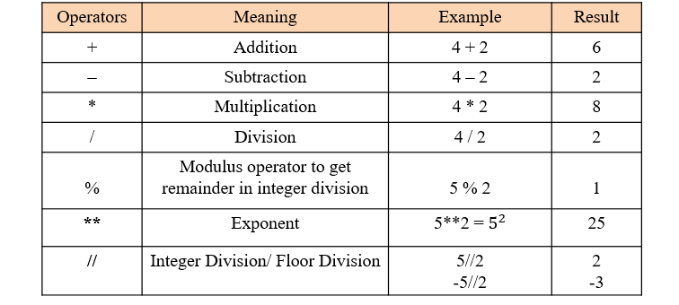
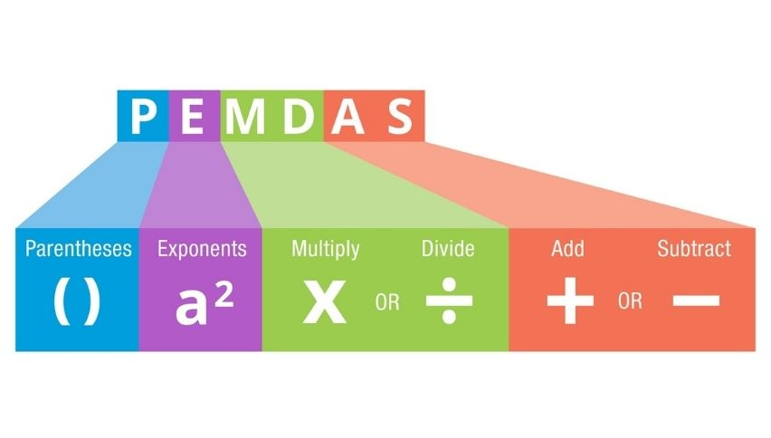
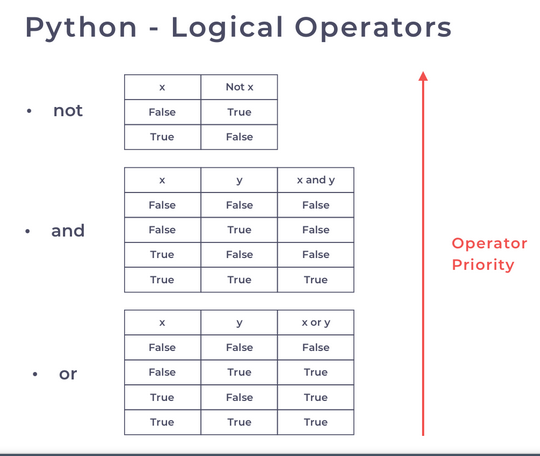

# Introduction to Python: Lesson 0102
---

In this lesson we are learning about the basics in Python

## First code


```python
print('Hello world!')
```

    Hello world!


## Basic Data Types

- **int**: integers or whole numbers - 0, 1, 2, 100, -2, ...
- **float**: floating-point or decimal numbers - 0.1, 2.3, 3.14, -2.199 ...
- **string**: collections of characters - '', 'Name', 'Some sentence.'
- **bool**: Boolean (binary) type - value can be **True** or **False**
- **None**: an empty value

[Basic Data Types in Python](https://realpython.com/python-data-types/)


```python
# print integer
print(2)
# print float
print(2.2)
# print string
print('This is Sparta!')
# print bool
print(True)
# print None
print(None)
```

    2
    2.2
    This is Sparta!
    True
    None


If we want to check the type of some value, we use the function **type**


```python
# print integer
print(type(2))
# print float
print(type(2.2))
# print string
print(type('This is Sparta!'))
# print bool
print(type(True))
# print None
print(type(None))
```

    <class 'int'>
    <class 'float'>
    <class 'str'>
    <class 'bool'>
    <class 'NoneType'>


---
## Variables

Variables are:
- containers for the values
- we use them so that we can easily manipulate values they contain and perform calculations

### Rules of naming

- variable names in Python can be any length
- can consist of uppercase and lowercase letters (A-Z, a-z), digits (0-9), and the underscore character (_).
- the first character of a variable name cannot be a digit
- it cannot be a reserved keyword:

```
    False 	def 	if 	raise
    None 	del 	import 	return
    True 	elif 	in 	try
    and 	else 	is 	while
    as		except 	lambda 	with
    assert 	finally nonlocal yield
    break 	for 	not 	
    class 	from 	or 	
    continue 	global 	pass
```

### Examples:
<font color='green'>**Good Naming**</font>
- num1
- user_name
- User007
- \_pi

<font color='red'>**Wrong Naming**</font>
- 007
- 1User
- or
- True

[Variables in Python](https://realpython.com/python-variables/)

[Pep 8 - Style Guide for Python Code](https://peps.python.org/pep-0008/)

### Attention

- e.g. **User** and **user** are two different variables


## Naming PEP8 Convention
- Snake Case should be used for functions and variable names.

`this_is_snake_case_naming`

- Pascal Case should be used for class names. (PEP 8 refers to this as the “CapWords” convention.)

`ThisIsPascalCaseNaming`

### Variable Assignment

In some programming languages we have two different events:
1. variable declaration or definition
2. value assignment

In Python a variable doesn't need any declaration or value type definition. We just assign the value.

Assignment is done with a single equals sign **(=)**. The statement that assings a value to a variable is called an assignment statement:
```Python
num1 = 3

user_name = 'Tom'

is_activated = False
```

We can also add a value with an assignment expression statement:
```python
num1 = 3 + 2
```
[Python Variables](https://realpython.com/python-variables/)

### Variable types

Though we don't find a strict definition of a constant values, there is a convention for the naming of the variables that should have a **constant** or **invariable** value. We call them **constants** and we use capital letters in naming them:
```python
PI = 3.14
PENALTY_PAY = 200
ERROR_MESSAGE = 'There was an error!`
```


```python
# assing value of 5 to a constant DEFAULT_STEP
DEFAULT_STEP = 5
# assign value of 'There Be Dragons' to variable "movie_title"
movie_title = 'There Be Dragons'
# assing value of 4+5 to variable "calculate_sum"
calculate_sum = 4 + 5

# print out all variable values
print(DEFAULT_STEP)
print(movie_title)
print(calculate_sum)
```

    5
    There Be Dragons
    9


---
## Operators

### Terminology

- an **operator** is usually a symbol or combination of symbols that allows you to perform a specific operation. This operation can act on one or more **operands**. If the operation involves a single operand, then the operator is **unary**. If the operator involves two operands, then the operator is **binary**. Operators must be part of **expressions**, which you can build using Python objects as operands.

- Assignment operators
- Arithmetic operators
- Comparison operators
- Boolean or logical operators
- Identity operators
- Membership operators
- Concatenation and repetition operators
- Bitwise operators

- Python has simple and compound statements:
    - **simple statement** is a construct that occupies a single logical line, like an assignment statement.
    - **compound statement** is a construct that occupies multiple logical lines, such as a for loop or a conditional statement.
    - **expression** is a simple statement that produces and returns a value.



### Order of operations - PEMDAS



In programming, this concept of precedence and the ability to override that precedence using parentheses is used not only in mathematical expressions, but also in expressions using logical operators such as AND, OR and NOT.
For now just remember the order of operations: PEMDAS (Please Excuse My Dear Aunt Sally!)


### Comparison or Relational Operators


The result values of comparing are always booleans: **True** or **False**

---
### Logical operators 

We use these operators to evaluate a statement to return either a **True**  or a  **False**

<table>
	<thead>
		<tr>
			<th class="ck_border" scope="col" style="border: 1px solid rgb(221, 221, 221);">Operator</th>
			<th class="ck_border" scope="col" style="border: 1px solid rgb(221, 221, 221);">Syntax</th>
			<th class="ck_border" scope="col" style="border: 1px solid rgb(221, 221, 221);">Description</th>
			<th class="ck_border" scope="col" style="border: 1px solid rgb(221, 221, 221);">Example</th>
		</tr>
	</thead>
	<tbody>
		<tr>
			<td class="ck_border" style="border: 1px solid rgb(221, 221, 221);">and</td>
			<td class="ck_border" style="border: 1px solid rgb(221, 221, 221);">x and y</td>
			<td class="ck_border" style="border: 1px solid rgb(221, 221, 221);">This returns <strong><span>&nbsp;True&nbsp;</span></strong>&nbsp;if both x and y are true</td>
			<td class="ck_border" style="border: 1px solid rgb(221, 221, 221);">
			<p>x = 10<br>
			x &gt; 5 and x &lt; 15</p>
			</td>
		</tr>
		<tr>
			<td class="ck_border" style="border: 1px solid rgb(221, 221, 221);">or</td>
			<td class="ck_border" style="border: 1px solid rgb(221, 221, 221);">x or y</td>
			<td class="ck_border" style="border: 1px solid rgb(221, 221, 221);">This returns&nbsp;<strong><span> True&nbsp;</span></strong><strong>&nbsp;</strong>if either x or y are true</td>
			<td class="ck_border" style="border: 1px solid rgb(221, 221, 221);">x = 10<br>
			x &gt; 5 or x &lt; 2</td>
		</tr>
		<tr>
			<td class="ck_border" style="border: 1px solid rgb(221, 221, 221);">not</td>
			<td class="ck_border" style="border: 1px solid rgb(221, 221, 221);">not x</td>
			<td class="ck_border" style="border: 1px solid rgb(221, 221, 221);">Reverses a result, so if something is&nbsp;<strong><span> True&nbsp;</span></strong>,<br>
			not turns it&nbsp;<strong><span>&nbsp;False&nbsp;</span></strong></td>
			<td class="ck_border" style="border: 1px solid rgb(221, 221, 221);">x = 10<br>
			not(x &gt; 5 and x &lt; 15)</td>
		</tr>
	</tbody>
<table>

<br>



## Errors

- There are different errors in Python. They occur when Python script is executed. Some of them would make the execution impssible, some would interrupt the execution.
- **Syntax errors**, also known as *parsing errors*, are perhaps the most common kind of complaint you get while you are still learning Python:


```python
while True print('Hello world')
```


      Cell In[2], line 1
        while True print('Hello world')
                   ^
    SyntaxError: invalid syntax


Link to the Python Docs - [Errors and Exceptions](https://docs.python.org/3/tutorial/errors.html)

We will talk about the Errors, Exceptions and Debugging in the comming lessons.

---
### Comments
[Comments in Python: Why are They Important And How to Use Them](https://www.simplilearn.com/tutorials/python-tutorial/comments-in-python)

There are multiple uses of writing comments in Python. Some significant uses include:
- Increasing readability
- Explaining the code to others
- Understanding the code easily after a long-term
- Including resources
- Re-using the existing code


Comments in Python provide numerous advantages. Their primary benefits include:

- Makes the code easily understandable by other programmers
- The code becomes self-explanatory
- Helps remember why we used a specific command, method, or function in the code
- Enables the interpreter to ignore some part of the code while testing

### Different Types of Comments

**Single-Line Comments**

Single-line comments begin with the “#” character. Anything that is written in a single line after ‘#’ is considered as a comment. The syntax for writing single-line comments is:

`# comments here`

There are two ways of using single-line comments in Python. You can use it before the code or next to the code.


```python
# looping through a range of 10 numbers
for i in range(10):
    print(i)  # prints 0 to 9
```

PEP8, Python Style Guide, recommends using less than 79 characters in a single-line comment to make it easier to read. If your comment is exceeding the recommended length, you can use the next type: multi-line comments.

**Multi-Line Comments**

Python does not support multi-line comments. However, there are multiple ways to overcome this issue. None of these ways are technically multi-line comments, but you can use them as one. The first way is by using `#` at the beginning of each line of the comment.


```python
# This is a sample multi-line comment
# You put a hashtag at the beginning of each line
# Comments are ignored by the interpreter
```

You can also use multi-line strings for commenting. To do this, use either a ‘’ or “” quotation marks three times.


```python
'''
This is a multi-line comment.
Just write here whatever you want.
Nothing will be executed.
'''
print("Hello World!")
```

    Hello World!


**Python Docstrings**

Python provides an in-built feature called docstrings for commenting on modules, methods, functions, objects, and classes. They are written in the first line after defining a module, function, method, etc., using three quotation marks (‘’ or “”). If you do not use it in the first line, the interpreter will not take it as a docstring. You can also access docstrings using the __doc__ attribute.

