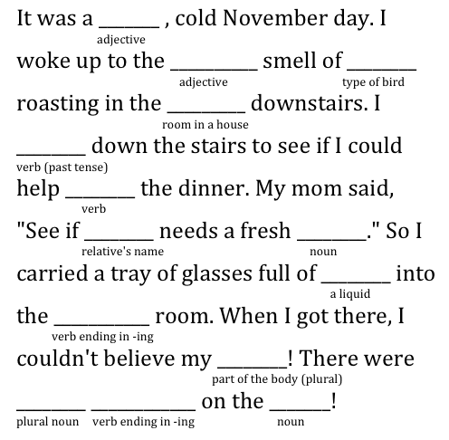

# Print and Input Functions and For Loop

We will understand better the so called **functional programming** in the next lessons. Here we will learn how to use the **print** and **input** functions.

## Print Function

**Print** is a function that is used to print text in the console. We have already seen the print function in the previous lesson. Let's see how it works.

- we can see the details on the Python documentation page [here](https://docs.python.org/3/library/functions.html#print)


```python
# basic print statement
print('Something')
print(2+2)
print('3 + 4 = ', 3+4)
```

    Something
    4
    3 + 4 =  7


These are the details of the print function from the Python documentation.

`print(*objects, sep=' ', end='\n', file=None, flush=False)`

- `sep` is an optional argument that specifies the separator between objects. The default separator is a space. If no separator is specified, no separator is printed.
- `end` is an optional argument that specifies the ending string. The default ending string is a newline. If no ending string is specified, no ending string is printed.
- `file` is an optional argument that specifies the file to write the output to. If no file is specified, the output is printed to the console.
- `flush` is an optional argument that specifies whether to flush the output buffer. The default is `False`. If `True`, the output buffer is flushed.


```python
# separator argument
print('This', 'is', 'a', 'test', sep='__')
print('a', 'b', 'c', sep='*')

# end argument
print('Hello', end=' ')
print('World')
print('!')

# file argument - we will see later

# flush argument - we will see later
```

    This__is__a__test
    a*b*c
    Hello World
    !


## Input Function

**Input** is a function that is used to get input from the user.

- we can see the details on the Python documentation page [here](https://docs.python.org/3/library/functions.html#input)

`input(prompt)` - where `prompt` is an optional argument that specifies the prompt to display. The default prompt is `> `.


```python
# let us try a basic input statement
input()  # this will wait for user input but the input is not stored
```


    'hello'


```python
# we need to store the input in a variable so that we can use it
a = input()
print(a)
```

    to


- The `input` function returns a string that is the input from the user. If no input is provided, the default value `''` or `empty string` is returned.

- if we want to store a number, we need to convert it to a number using `int()`, `float()`, etc.


```python
# input of a number
num = input('Enter a number: ')
num = int(num)  # convert the input to an integer

print(num**2)
```

    16


If we expect to get a number, but the user inputs letters, we get an error.


```python
num = input('Enter a number: ')
num = int(num)  # convert the input to an integer - here we get an error if the user inputs letters
print(num)
```


    ---------------------------------------------------------------------------

    ValueError                                Traceback (most recent call last)

    Cell In[13], line 2
          1 num = input('Enter a number: ')
    ----> 2 num = int(num)  # convert the input to an integer - here we get an error if the user inputs letters
          3 print(num)


    ValueError: invalid literal for int() with base 10: 'po'


## For Loop

- We are introducing just a basic version of a for loop in order to have some repetitive skills.
- we use for loop to do some repetitive task for some definitive number of times.

`for i in range(5)` - where `i` is a variable that represents the number of times the loop will repeat.
- range(5) will give us the numbers from 0 to 4


```python
# basic for loop
for i in range(5):
    print(i)
```

    0
    1
    2
    3
    4


```python
for i in range(5):
    print('#', end='')
```

    #####


```python
for i in range(5):
    print('#'*(i+1))
```

    #
    ##
    ###
    ####
    #####


```python
for i in range(5):
    print('#'*i)

for i in range(5):
    print('#'*(5-i))
```

    
    #
    ##
    ###
    ####
    #####
    ####
    ###
    ##
    #


```python
for i in range(5):
    print(f'{'#'*(i*2 +1):^12}')
```

         #      
        ###     
       #####    
      #######   
     #########  


---

Let us practice now some of these skills.


```python
# input dogs name and years and output his name and age in dog years
name = input('Enter your dogs name: ')
age = int(input('Enter your dogs age: '))

print(f'{name} is {age*7} dog years old')
```

    Fido is 70 dog years old


**Madlib Game**

- Let us create a madlib game using the print and input functions.

This is an example from the web site [https://hobbylark.com/party-games/How-to-Make-Your-Own-Mad-Libs](https://hobbylark.com/party-games/How-to-Make-Your-Own-Mad-Libs)




```python
# madlib game 

adjective1 = input('Enter an adjective: ')
adjective2 = input('Enter another adjective: ')
type_of_bird = input('Enter a type of bird: ')
room_in_a_house = input('Enter a room in a house: ')
verb_past_tense = input('Enter a verb in the past tense: ')
verb = input('Enter a verb in infinitive (to ...): ')
relative_name = input('Enter a relative\'s name: ')
noun = input('Enter a noun: ')
liquid = input('Enter a liquid: ')
room = input('Enter another room in a house: ')
body_part_plural = input('Enter a part of the body (plural): ')
plural_noun = input('Enter a plural noun: ')
verb_ending_in_ing = input('Enter a verb ending in -ing: ')
noun2 = input('Enter another noun: ')

# Use an f-string to insert the input into the template
story = f'''It was a {adjective1}, cold November day.
I woke up to the {adjective2} smell of {type_of_bird} roasting
in the {room_in_a_house} downstairs. I {verb_past_tense} down the stairs
to see if I could help {verb} the dinner.
My mom said, 'See if {relative_name} needs a fresh {noun}.'
So I carried a tray of glasses full of {liquid} into the {room}.
When I got there, I couldn't believe my {body_part_plural}!
There were {plural_noun} {verb_ending_in_ing} on the {noun2}!'''

# Output the completed story
print(story)

```

    It was a rare, cold November day.
    I woke up to the smart smell of swallow roasting
    in the bedroom downstairs. I cut down the stairs
    to see if I could help to see the dinner.
    My mom said, 'See if Mark needs a fresh pot.'
    So I carried a tray of glasses full of Coke into the kitchen.
    When I got there, I couldn't believe my ears!
    There were roads playing on the killer!


```python

```
