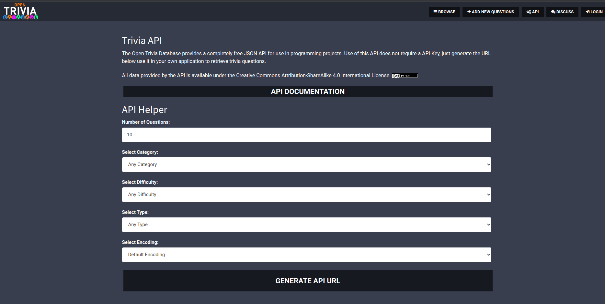
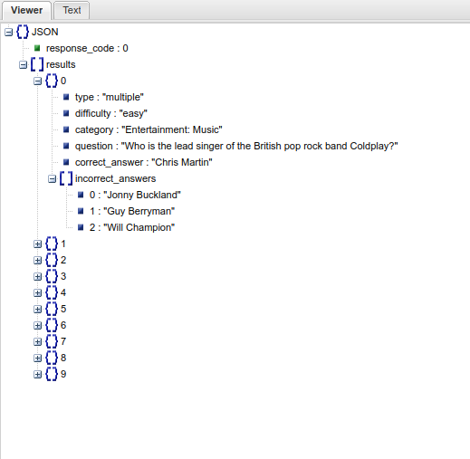
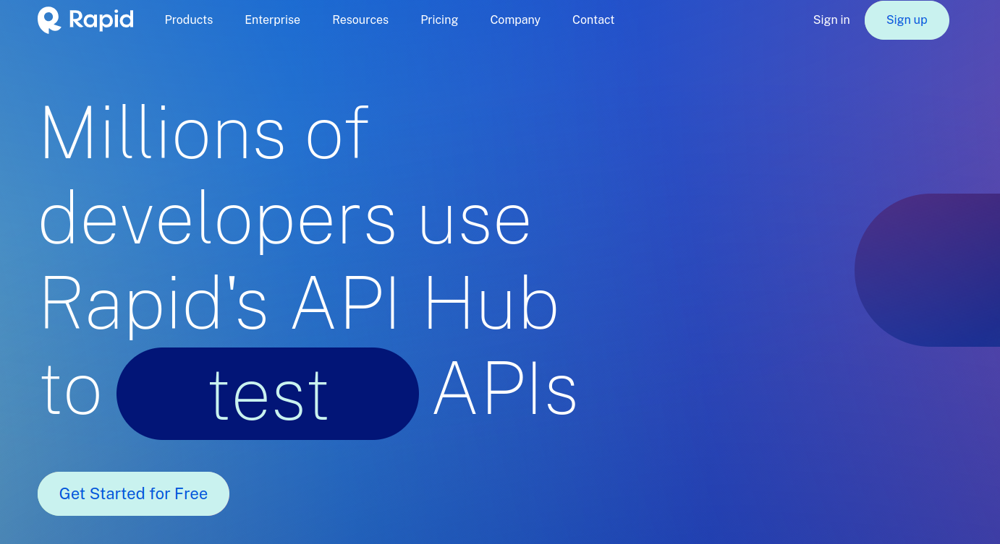
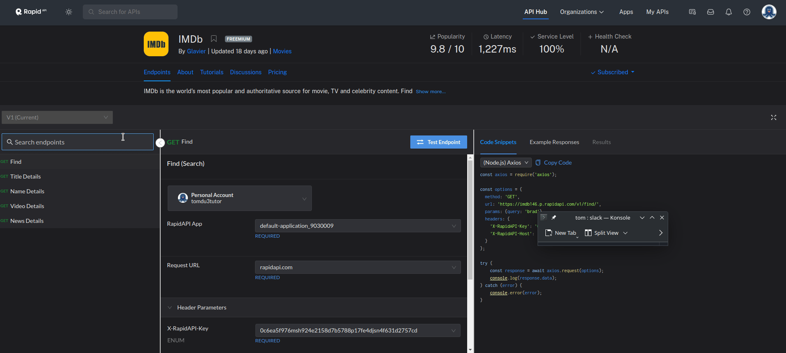

Useful links:
- [Python and REST APIs: Interacting With Web Services](https://realpython.com/api-integration-in-python/)
- [Python API Tutorial](https://www.geeksforgeeks.org/python-api-tutorial-getting-started-with-apis/)

### 6.3.1 - What is an API?

APIs or *Application Programming Interfaces* are sets of protocols, routines, and tools for building software applications. They are a crucial part of any software application. In this lesson, we will learn about APIs and how to use them in Python.

A RESTful API is an interface that two computer systems use to exchange information securely over the internet. Most business applications have to communicate with other internal and third-party applications to perform various tasks.

Representational State Transfer (REST) is a software architecture that imposes conditions on how an API should work. REST was initially created as a guideline to manage communication on a complex network like the internet. 

## 6.3.2. Requests Module

- In order to use APIs in Python, we need to import the `requests` module. Requests is a Python module that makes it easy to send HTTP requests using Python.
- This is not a built-in module. You need to install it first.
- You can install it with the following command: `pip install requests`
- You can check if it is installed with the following command: `pip show requests`


```python
!pip install requests
```

    Requirement already satisfied: requests in /home/tom/anaconda3/envs/myenv/lib/python3.12/site-packages (2.31.0)
    Requirement already satisfied: charset-normalizer<4,>=2 in /home/tom/anaconda3/envs/myenv/lib/python3.12/site-packages (from requests) (3.3.2)
    Requirement already satisfied: idna<4,>=2.5 in /home/tom/anaconda3/envs/myenv/lib/python3.12/site-packages (from requests) (3.7)
    Requirement already satisfied: urllib3<3,>=1.21.1 in /home/tom/anaconda3/envs/myenv/lib/python3.12/site-packages (from requests) (2.2.1)
    Requirement already satisfied: certifi>=2017.4.17 in /home/tom/anaconda3/envs/myenv/lib/python3.12/site-packages (from requests) (2024.2.2)


## 6.3.3. JSON File

- Before we start our API calls, we need to understand JSON. A JSON is a lightweight data-interchange format that is easy for humans to read and write. JSON is a text format that is used to store and transport data. It is not a data type in Python. It is a data format that is used to transfer data between computers.
- It is called JSON as abbreviation for JavaScript Object Notation.
- It is a very popular format and it's use goes beyond the scope of this lesson.
 
 - Structurally, JSON File is a combination of dictionaries and lists.
 - Let us see an example of a JSON file (`sample.json`).


```python
!cat data/sample.json
```

    [
      {
        "id": 1,
        "name": "John Doe",
        "email": "john.doe@example.com",
        "age": 25,
        "city": "New York"
      },
      {
        "id": 2,
        "name": "Jane Smith",
        "email": "jane.smith@example.com",
        "age": 30,
        "city": "Chicago"
      },
      {
        "id": 3,
        "name": "Mike Johnson",
        "email": "mike.johnson@example.com",
        "age": 40,
        "city": "San Francisco"
      },
      {
        "id": 4,
        "name": "Emma Wilson",
        "email": "emma.wilson@example.com",
        "age": 28,
        "city": "Los Angeles"
      },
      {
        "id": 5,
        "name": "David Lee",
        "email": "david.lee@example.com",
        "age": 35,
        "city": "Austin"
      }
    ]
    
    


- As you can notice, this data stucture is a list of dictionaries.
- Let us see how to read it in Python. For that, we need to import the `json` module. 

> Note: If you are testing this code, you need to create a `data` folder in your current working directory. Place in it these two json files that you can dowload from the following links:
> [questions.json](https://drive.google.com/file/d/1l7aDdOjw-ARNIl8rYTRW28cyUXsRTvpz/view?usp=drive_link)
> [sample.json](https://drive.google.com/file/d/1zjj1xtvNghoXgHqiBEAN0lpTMmX8pF3n/view?usp=drive_link)

```python
import json  # module needed for decoding/encoding JSON data

with open("data/sample.json", "r") as f:
    data = json.load(f)

print(data)
```

    [{'id': 1, 'name': 'John Doe', 'email': 'john.doe@example.com', 'age': 25, 'city': 'New York'}, {'id': 2, 'name': 'Jane Smith', 'email': 'jane.smith@example.com', 'age': 30, 'city': 'Chicago'}, {'id': 3, 'name': 'Mike Johnson', 'email': 'mike.johnson@example.com', 'age': 40, 'city': 'San Francisco'}, {'id': 4, 'name': 'Emma Wilson', 'email': 'emma.wilson@example.com', 'age': 28, 'city': 'Los Angeles'}, {'id': 5, 'name': 'David Lee', 'email': 'david.lee@example.com', 'age': 35, 'city': 'Austin'}]


- To make the output more readable, we can use the `pprint` (pretty print) module.


```python
from pprint import pprint

pprint(data)
```

    [{'age': 25,
      'city': 'New York',
      'email': 'john.doe@example.com',
      'id': 1,
      'name': 'John Doe'},
     {'age': 30,
      'city': 'Chicago',
      'email': 'jane.smith@example.com',
      'id': 2,
      'name': 'Jane Smith'},
     {'age': 40,
      'city': 'San Francisco',
      'email': 'mike.johnson@example.com',
      'id': 3,
      'name': 'Mike Johnson'},
     {'age': 28,
      'city': 'Los Angeles',
      'email': 'emma.wilson@example.com',
      'id': 4,
      'name': 'Emma Wilson'},
     {'age': 35,
      'city': 'Austin',
      'email': 'david.lee@example.com',
      'id': 5,
      'name': 'David Lee'}]


I we wish to access the precise data, we can use the `data` variable and notation for accessing lists and dictionaries.


```python
# fetch name of the first person
print(data[0]["name"])  # 0 is the index of the first person, and `name` is the key of the person's name

# fetch the names and the emails of all the people
for person in data:
    print(person["name"], person["email"])
```

    John Doe
    John Doe john.doe@example.com
    Jane Smith jane.smith@example.com
    Mike Johnson mike.johnson@example.com
    Emma Wilson emma.wilson@example.com
    David Lee david.lee@example.com


### 6.3.4. API URL data

Let us see how we can fetch data from an online API. We will use [**Open Trivia Database**](https://opentdb.com/) as an example.

Let us interact first with the data directly from the website.
- Click on the link above and then on the menu go to the **API** tab or click on it, or enter **https://opentdb.com/api_config.php** driectly in the **URL** field of your browser.
- This is where the data is located.


Here we can select different parameters to get different data. If we just click on the **Generate Api Url** button, it will generate a URL that will fetch 10 random questions. You can also change the parameters and generate the URL.


The resulting url is `https://opentdb.com/api.php?amount=10`

- Copy the link and past it in the url address field of your browser and press enter. The data will be fetched automatically and displayed in the browser as a json file structure.
- Copy the contents of the browser (the json file). Now, we can open an empty file called `questions.json` and paste the contents inside.
- Save the file.

- Now, let us open a website [json viewer](https://jsonviewer.stack.hu/). Paste the contents inside the field of the website (it says `Paste JSON code here...`).
- Once the data is loaded, click on the menu button that says `Viewer`. The data is displayed in the browser as a json file structure.


Here we can more easily study the structure of the data that we will be later accessing via Python.

### 6.3.5. Accessing JSON data from a file

Let us work with the file `questions.json` that we created in the previous step. In the following steps, we will use the `json` module to access the data, read the data and go through it.


```python
import json
from pprint import pprint

with open("data/questions.json", "r") as f:
    questions = json.load(f)

# pprint(questions)
pprint(questions['results'][0])  # first question record
pprint(questions['results'][0]['question'])  # first question record - question

pprint(questions['results'][0]['incorrect_answers'])  # first question record - incorrect answers

pprint(questions['results'][0]['correct_answer'])  # first question record - correct answer
```

    {'category': 'Entertainment: Video Games',
     'correct_answer': 'Mike Harrington',
     'difficulty': 'medium',
     'incorrect_answers': ['Robin Walker', 'Marc Laidlaw', 'Stephen Bahl'],
     'question': 'Along with Gabe Newell, who co-founded Valve?',
     'type': 'multiple'}
    'Along with Gabe Newell, who co-founded Valve?'
    ['Robin Walker', 'Marc Laidlaw', 'Stephen Bahl']
    'Mike Harrington'


### 6.3.6. Accessing JSON data from a website with Python
Now, we well use Python to access the data from the website.
1. First, we need to import the `requests` module.
2. Next, we need to import the `json` module.
3. Now, we can use the `requests` module to fetch the data from the website.
4. We are fetching the data from the website and storing the data in a variable called `response`.
5. Then we need to check if the data was fetched successfully, that is to check if the status code is 200 (OK). If it is not 200, we need to handle the error.
   - there are different reasons why the requesting data was not successful. Or we have made a mistake in our request, or there is a problem with the website, etc.
   - here are the possible status codes and their meanings:
     - `200`: OK
     - `400`: Bad Request
     - `401`: Unauthorized
     - `403`: Forbidden
     - `404`: Not Found
     - `500`: Internal Server Error
     - `502`: Bad Gateway
     - `503`: Service Unavailable
     - `504`: Gateway Timeout
     - `505`: HTTP Version Not Supported
     - `520`: Unknown Error
6. If we have successfully fetched the data, we need to parse the data into a readable format. We can use the `json` module to parse the data.
7. Once the data is parsed, we can access the data we need in a way that is already known to us.


```python
# import necessary modules
import requests
import json

# fetch data
url = "https://opentdb.com/api.php?amount=10"  # this is the URL of the API endpoint that we already got from the website 

response = requests.get(url)  # we are fetching data from the URL

if response.status_code == 200:  # if the response is successful
    questions = response.json()  # we are decoding the JSON data
    pprint(questions)
    pprint(questions['results'][0]['question'])
    pprint(questions['results'][0]['correct_answer'])
    pprint(questions['results'][0]['incorrect_answers'])
    pprint(questions['results'][0]['type'])

    # we can also decode the JSON data and save it to a file
    with open("API-questions.json", "w") as f:
        json.dump(questions, f)
    print("Questions saved to API-questions.json")
else:
    print(f"Error: {response.status_code}")


```

    {'response_code': 0,
     'results': [{'category': 'Politics',
                  'correct_answer': 'Ronald Reagan',
                  'difficulty': 'medium',
                  'incorrect_answers': ['Jimmy Carter',
                                        'Bill Clinton',
                                        'Richard Nixon'],
                  'question': 'Who was the 40th President of the USA?',
                  'type': 'multiple'},
                 {'category': 'Entertainment: Television',
                  'correct_answer': 'True',
                  'difficulty': 'medium',
                  'incorrect_answers': ['False'],
                  'question': 'Klingons once had a period of Democracy in their '
                              'history, they referred to it as the &quot;Dark '
                              'Times&quot;.',
                  'type': 'boolean'},
                 {'category': 'Entertainment: Video Games',
                  'correct_answer': 'Sonic the Hedgehog',
                  'difficulty': 'easy',
                  'incorrect_answers': ['Dynamite Headdy', 'Alex Kidd', 'Opa-Opa'],
                  'question': 'Which of these characters is the mascot of the '
                              'video game company SEGA?',
                  'type': 'multiple'},
                 {'category': 'Entertainment: Video Games',
                  'correct_answer': 'False',
                  'difficulty': 'easy',
                  'incorrect_answers': ['True'],
                  'question': 'Codemasters is the developer of the Gran Turismo '
                              'series.',
                  'type': 'boolean'},
                 {'category': 'Geography',
                  'correct_answer': 'False',
                  'difficulty': 'easy',
                  'incorrect_answers': ['True'],
                  'question': 'New Haven is the capital city of the state of '
                              'Connecticut in the United States.',
                  'type': 'boolean'},
                 {'category': 'Science: Computers',
                  'correct_answer': 'Micronesia',
                  'difficulty': 'hard',
                  'incorrect_answers': ['Fiji', 'Tuvalu', 'Marshall Islands'],
                  'question': 'The internet domain .fm is the country-code '
                              'top-level domain for which Pacific Ocean island '
                              'nation?',
                  'type': 'multiple'},
                 {'category': 'Entertainment: Video Games',
                  'correct_answer': 'True',
                  'difficulty': 'medium',
                  'incorrect_answers': ['False'],
                  'question': 'Mortal Kombat was almost based on Jean-Claude Van '
                              'Damme movie.',
                  'type': 'boolean'},
                 {'category': 'Entertainment: Video Games',
                  'correct_answer': 'Jack Black',
                  'difficulty': 'easy',
                  'incorrect_answers': ['Kanye West', 'Lemmy', 'Ozzy Osbourne'],
                  'question': 'Who stars in Brutal Legend?',
                  'type': 'multiple'},
                 {'category': 'Entertainment: Music',
                  'correct_answer': 'Left Alone',
                  'difficulty': 'hard',
                  'incorrect_answers': ['What About Us',
                                        'This Song Is Not About A Girl',
                                        'Drop The Game'],
                  'question': 'Which of these is NOT a song featured on the '
                              'Lockjaw EP released in 2013 by Flume &amp; Chet '
                              'Faker?',
                  'type': 'multiple'},
                 {'category': 'Geography',
                  'correct_answer': 'Andorra',
                  'difficulty': 'medium',
                  'incorrect_answers': ['Liechtenstein', 'Monaco', 'San Marino'],
                  'question': 'What tiny principality lies between Spain and '
                              'France?',
                  'type': 'multiple'}]}
    'Who was the 40th President of the USA?'
    'Ronald Reagan'
    ['Jimmy Carter', 'Bill Clinton', 'Richard Nixon']
    'multiple'
    Questions saved to API-questions.json


### 6.3.7. Accessing API data from a website with Python and authentication

**Different APIs**
- Private API
- Public API
- API with authentication
- API with authorization
- API with authentication and authorization
- API with authentication, authorization, and rate limiting
- API with authentication, authorization, rate limiting, and caching
- API with authentication, authorization, rate limiting, caching, and pagination

- We will be going through the same steps as in the previous step, but this time we will use authentication. For many APis that require authentication, we need to provide the username and password to access the API. For this, we will use the `requests` module and `json` module.

The website API that we will be using is [Rapid APi](https://rapidapi.com/). It contains many different APIs that we will be using in this lesson. We will be using the IMDB API.



As you can see, we have a Free Subscription that we will be using that also limits the number of requests we make to 500 per month. This is important to have in mind when using the app, especially if our programm is running constantly - like on a web page.

Once you have your account set up, go to the [IMDb API on Rapid Api](https://rapidapi.com/Glavier/api/imdb146/) and `subscribe to test` for the free plan.


- The RAPID APIs are very developer friendly. What is needed to do now is to go to the page of the IMDB API and select the programming language and you will get the code you can use to access the API together with the access keys.




```python
# code from Rapid Api
import requests

url = "https://imdb146.p.rapidapi.com/v1/find/"

querystring = {"query":"Die Hard"}

headers = {
	"X-RapidAPI-Key": "xxxxxxxxxxx",  # insert your API key
	"X-RapidAPI-Host": "imdb146.p.rapidapi.com"
}

response = requests.get(url, headers=headers, params=querystring)

pprint(response.json())
```

    {'companyResults': {'results': []},
     'findPageMeta': {'includeAdult': False,
                      'isExactMatch': False,
                      'searchTerm': 'die hard'},
     'keywordResults': {'results': []},
     'nameResults': {'hasExactMatches': True,
                     'nextCursor': 'eyJlc1Rva2VuIjpbIjIzMzcuMDYzNyIsIm5tNzQ3NDY2NyJdLCJmaWx0ZXIiOiJ7XCJpbmNsdWRlQWR1bHRcIjpmYWxzZSxcImlzRXhhY3RNYXRjaFwiOmZhbHNlLFwic2VhcmNoVGVybVwiOlwiZGllIGhhcmRcIixcInR5cGVcIjpbXCJOQU1FXCJdfSJ9',
                     'results': [{'akaName': 'Die Hard',
                                  'displayNameText': 'Jonathan McLain',
                                  'id': 'nm9590276',
                                  'knownForJobCategory': 'Producer',
                                  'knownForTitleText': 'She',
                                  'knownForTitleYear': '2021'},
                                 {'akaName': 'DHL aka "Die Hard Leon"',
                                  'displayNameText': 'Leon Lee',
                                  'id': 'nm6092181',
                                  'knownForJobCategory': 'Actor',
                                  'knownForTitleText': 'Sky Hunter',
                                  'knownForTitleYear': '2017'},
                                 {'akaName': 'Die Hard',
                                  'displayNameText': 'Tom McClane',
                                  'id': 'nm2647687',
                                  'knownForJobCategory': 'Actor',
                                  'knownForTitleText': 'Suspension of Disbelief',
                                  'knownForTitleYear': '2012'},
                                 {'avatarImageModel': {'caption': 'Goldie Hawn in '
                                                                  'Cactus Flower '
                                                                  '(1969)',
                                                       'maxHeight': 4602,
                                                       'maxWidth': 3684,
                                                       'url': 'https://m.media-amazon.com/images/M/MV5BMTc0MDQ5MDUzMF5BMl5BanBnXkFtZTgwMjIwNTU5MTE@._V1_.jpg'},
                                  'displayNameText': 'Goldie Hawn',
                                  'id': 'nm0000443',
                                  'knownForJobCategory': 'Actress',
                                  'knownForTitleText': 'Private Benjamin',
                                  'knownForTitleYear': '1980'},
                                 {'akaName': 'Die Hard Pianist',
                                  'displayNameText': 'Caitlin Yarbrough',
                                  'id': 'nm7474667',
                                  'knownForJobCategory': 'Composer',
                                  'knownForTitleText': 'Emily',
                                  'knownForTitleYear': '2013'}]},
     'resultsSectionOrder': ['TITLE', 'NAME'],
     'titleResults': {'hasExactMatches': True,
                      'nextCursor': 'eyJlc1Rva2VuIjpbIjExOTgzNC4wNyIsInR0MTYwNjM3OCJdLCJmaWx0ZXIiOiJ7XCJpbmNsdWRlQWR1bHRcIjpmYWxzZSxcImlzRXhhY3RNYXRjaFwiOmZhbHNlLFwic2VhcmNoVGVybVwiOlwiZGllIGhhcmRcIixcInR5cGVcIjpbXCJUSVRMRVwiXX0ifQ==',
                      'results': [{'id': 'tt0095016',
                                   'imageType': 'movie',
                                   'titleNameText': 'Die Hard',
                                   'titlePosterImageModel': {'caption': 'Bruce '
                                                                        'Willis in '
                                                                        'Die Hard '
                                                                        '(1988)',
                                                             'maxHeight': 1600,
                                                             'maxWidth': 1066,
                                                             'url': 'https://m.media-amazon.com/images/M/MV5BZjRlNDUxZjAtOGQ4OC00OTNlLTgxNmQtYTBmMDgwZmNmNjkxXkEyXkFqcGdeQXVyNzkwMjQ5NzM@._V1_.jpg'},
                                   'titleReleaseText': '1988',
                                   'titleTypeText': '',
                                   'topCredits': ['Bruce Willis', 'Alan Rickman']},
                                  {'id': 'tt0112864',
                                   'imageType': 'movie',
                                   'titleNameText': 'Die Hard with a Vengeance',
                                   'titlePosterImageModel': {'caption': 'Bruce '
                                                                        'Willis in '
                                                                        'Die Hard '
                                                                        'with a '
                                                                        'Vengeance '
                                                                        '(1995)',
                                                             'maxHeight': 1500,
                                                             'maxWidth': 1005,
                                                             'url': 'https://m.media-amazon.com/images/M/MV5BZjI0ZWFiMmQtMjRlZi00ZmFhLWI4NmYtMjQ5YmY0MzIyMzRiXkEyXkFqcGdeQXVyMTQxNzMzNDI@._V1_.jpg'},
                                   'titleReleaseText': '1995',
                                   'titleTypeText': '',
                                   'topCredits': ['Bruce Willis', 'Jeremy Irons']},
                                  {'id': 'tt0337978',
                                   'imageType': 'movie',
                                   'titleNameText': 'Live Free or Die Hard',
                                   'titlePosterImageModel': {'caption': 'Bruce '
                                                                        'Willis in '
                                                                        'Live Free '
                                                                        'or Die '
                                                                        'Hard '
                                                                        '(2007)',
                                                             'maxHeight': 2048,
                                                             'maxWidth': 1392,
                                                             'url': 'https://m.media-amazon.com/images/M/MV5BNDQxMDE1OTg4NV5BMl5BanBnXkFtZTcwMTMzOTQzMw@@._V1_.jpg'},
                                   'titleReleaseText': '2007',
                                   'titleTypeText': '',
                                   'topCredits': ['Bruce Willis', 'Justin Long']},
                                  {'id': 'tt0099423',
                                   'imageType': 'movie',
                                   'titleNameText': 'Die Hard 2',
                                   'titlePosterImageModel': {'caption': 'Bruce '
                                                                        'Willis in '
                                                                        'Die Hard '
                                                                        '2 (1990)',
                                                             'maxHeight': 1500,
                                                             'maxWidth': 1013,
                                                             'url': 'https://m.media-amazon.com/images/M/MV5BMzMzYzk3ZTEtZDg0My00MTY5LWE3ZmQtYzNhYjhjN2RhZGRjL2ltYWdlXkEyXkFqcGdeQXVyNTAyODkwOQ@@._V1_.jpg'},
                                   'titleReleaseText': '1990',
                                   'titleTypeText': '',
                                   'topCredits': ['Bruce Willis',
                                                  'William Atherton']},
                                  {'id': 'tt1606378',
                                   'imageType': 'movie',
                                   'titleNameText': 'A Good Day to Die Hard',
                                   'titlePosterImageModel': {'caption': 'Bruce '
                                                                        'Willis '
                                                                        'and Jai '
                                                                        'Courtney '
                                                                        'in A Good '
                                                                        'Day to '
                                                                        'Die Hard '
                                                                        '(2013)',
                                                             'maxHeight': 800,
                                                             'maxWidth': 540,
                                                             'url': 'https://m.media-amazon.com/images/M/MV5BMTcwNzgyNzUzOV5BMl5BanBnXkFtZTcwMzAwOTA5OA@@._V1_.jpg'},
                                   'titleReleaseText': '2013',
                                   'titleTypeText': '',
                                   'topCredits': ['Bruce Willis',
                                                  'Jai Courtney']}]}}


```python
response.status_code
```


    200


```python
titles = [title for title in response.json()['titleResults']['results']]
titles_sorted = [title['titleNameText'] for title in sorted(titles, key=lambda x: x.get('titleReleaseText', 0))]  # nice example of use of lambda

pprint(titles_sorted)
```

    ['Die Hard',
     'Die Hard 2',
     'Die Hard with a Vengeance',
     'Live Free or Die Hard',
     'A Good Day to Die Hard']


With the APIs the most important thing is the documentation. It is a good place to learn how to use the API.
