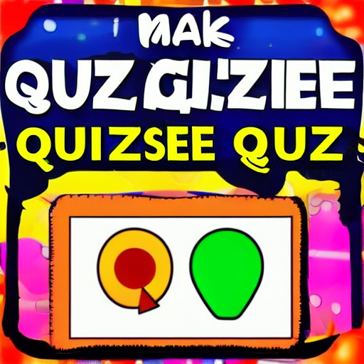

**Summary of the Project:**

The project is a Python implementation of the quiz game. The game is designed to simulate the experience of playing the game, with features such as:

1. A quiz game with 15 questions, each with a different point value. The code should generate 3 sets of 5 random questions and answers. These 3 sets are three difficulty levels (easy, moderate, and hard). The questions should gradualy progress from the easiest to the hardest.
2. A scoring system that keeps track of the player's points and displays them at the end of the game.
3. A high score system that saves the player's score and displays it in a leaderboard.
4. A menu system that allows the player to choose between playing the game, viewing their high scores, viewing instructions on how to play, or quitting the game.

**Guidelines for Students:**

To complete this project, students will need to follow these guidelines:

1. **Quiz Game:** The quiz game should be implemented using a class-based approach. The class should have methods for generating questions, checking answers, and keeping track of the player's score. The game ends when the user enters a wrong answer or when all the questions are answered.
2. **Scoring System:** The scoring system should be implemented using a dictionary that maps question numbers to point values. The system should also keep track of the player's total score and display it at the end of the game.
3. **High Score System:** The high score system should be implemented using a `csv` or `json` file. The system should save the player's score and display it in a leaderboard.
4. **Menu System:** The menu system should be implemented using a simple text-based menu that allows the player to choose between playing the game, viewing their high scores, viewing instructions on how to play, or quitting the game.
5. **API/Web Scraping:** Students are encouraged to use APIs or web scraping techniques to fetch data from external sources. For example, they could use the Trivia API to fetch questions and answers.
6. **Error Handling:** Students should implement error handling mechanisms to handle invalid user input, incorrect answers, and other potential errors that may arise during gameplay.

**Suggestions for Using APIs or Web Scraping:**

1. **Trivia API:** Use the Trivia API to fetch questions and answers for different categories and difficulty levels.

**Additional Tips:**

1. **Use Commenting:** Use comments to explain your code and make it easier for others to understand.
2. **Test Your Code:** Test your code thoroughly to ensure that it works correctly and handles errors properly.
3. **Follow PEP8 Guidelines:** Follow PEP8 guidelines for coding style and formatting.
4. **Use Version Control (optional):** Use version control tools such as Git to track changes to your code and collaborate with others.
5. **External Files For Screen Outputs:** Use external files for screen outputs such as a summary of the game, win/lose screen, instructions how to play, menu screen. Avoid using multiple line strings when possible.
6. **Implement Key Press detection and screen cleaning:** Use key press detection and screen cleaning to make the game more responsive and user-friendly. There are differences between Windows and Unix systems, so you would have to detect which system is being used in order to have these options working.
7. **Make necessary setup files**: Make necessary setup files for your projects:
   - `.gitignore`
   - `requirements.txt`
   - `README.md`
   - `.env`
8. **Use Documentation:** Write documentation for your code and explain how it works, which technologies you are using, and features of your code.
9. **GitHub Upload:** Upload your project to GitHub.
10. **YouTube Video:** Record and upload a YouTube video of your project where you explain your code and the execution of it.

**Additional Resources:**

- [Trivia API](https://opentdb.com/api_config.php)
- [Code Institue Python Linter](https://pep8ci.herokuapp.com/)
- [PEP8 Guidelines](https://www.python.org/dev/peps/pep-0008/)

**Conclusion:**

The project should be your showcase of Python knowledge and skills. It should be a fun and educational learning experience. And I will assist all of you to make it presentable and according to the industry standards.
