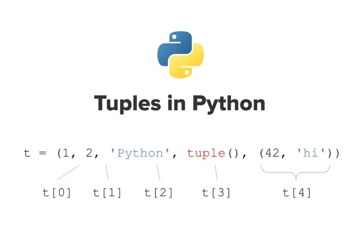
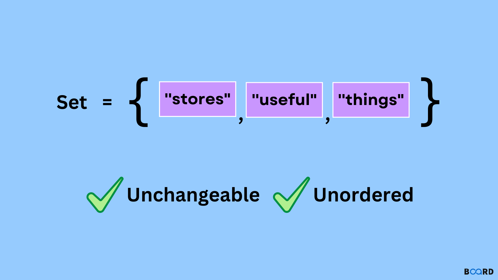
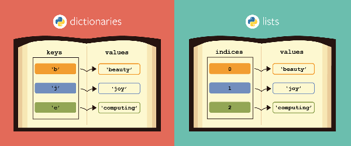

## 4.1 Tuples
[*Python Tuples* in W3Schools](https://www.w3schools.com/python/python_tuples.asp)


- Tuples are used to store multiple items in a single variable. They are ordered, immutable/unchangeable collections of elements.
- They allow duplicate elements.
- We generally use tuples when we have a lot of data and we don't want to change it.
- We write them inside round brackets - `(el1, el2, el3)`


```python
# tuple example
my_tuple = (1, 2, 3)
print(my_tuple)
print(my_tuple[1])  # access the second element, element on the index 1
```

    (1, 2, 3)
    2


### 4.1.1 Methods with tuples

- these are the methods we can use with tuples:
  - `count` - returns the number of times an element appears
  - `index` - returns the index of an element
  - `len` - returns the length of the tuple
  - `max` - returns the maximum value
  - `min` - returns the minimum value
  - `sum` - returns the sum of all elements
  - `sorted` - sorts the tuple
  - `reverse` - reverses the tuple
  - `tuple` - converts a list to a tuple


```python
# forbidden methods examples

# appending the tuple
my_tuple = (1, 2, 3)
my_tuple.append(4)  # AttributeError: 'tuple' object has no attribute 'append'

# changing the elements in the tuple
my_tuple = (1, 2, 3)
my_tuple[1] = 4  # TypeError: 'tuple' object does not support item assignment

# deleting the tuple
del my_tuple  # NameError: name 'my_tuple' is not defined
```


    ---------------------------------------------------------------------------

    AttributeError                            Traceback (most recent call last)

    Cell In[5], line 5
          1 # forbidden methods examples
          2 
          3 # appending the tuple
          4 my_tuple = (1, 2, 3)
    ----> 5 my_tuple.append(4)  # AttributeError: 'tuple' object has no attribute 'append'
          7 # changing the elements in the tuple
          8 my_tuple = (1, 2, 3)


    AttributeError: 'tuple' object has no attribute 'append'


```python
# allowed methods examples

# len
my_tuple = (1, 2, 3)
print(len(my_tuple))

# max
my_tuple = (1, 2, 3)
print(max(my_tuple))

# min
my_tuple = (1, 2, 3)
print(min(my_tuple))

# sum
my_tuple = (1, 2, 3)
print(sum(my_tuple))
```

    3
    3
    1
    6


### 4.1.2 Tuple Packing and Unpacking

- `packing` means assigning multiple values to the tuple
  - syntax: `my_tuple = (value1, value2, value3)`

- under the term `unpacking` we mean extracting the values from the tuple to the variables
  - syntax: `value1, value2, value3 = my_tuple`
  - in order to do this we need to have the same number of variables as the number of elements in the tuple


```python
# unpacking the tuple
my_tuple = (1, 2, 3)
print(my_tuple)

a, b, c = my_tuple
print(a)
print(b)
print(c)
```

    (1, 2, 3)
    1
    2
    3


- There's also a special sytax for unpacking a tuple that can be used when the number of variables is not equal to the number of elements in the tuple.
  - syntax: `value1, *value2, value3 = my_tuple`
    - `value1` will be the first element in the tuple
    - `value2` will be a list of all the elements that were not unpacked
    - `value3` will be the last element in the tuple
- or we cane use it like this:
  - syntax: `value1, value2, value3, *value4 = my_tuple`
    - `value4` will be a list of all the remaining elements that were not unpacked
  


```python
# example unpacking with asterisk
my_tuple = (1, 2, 3, 4, 5)
print(my_tuple)
a, b, *c = my_tuple
print(a)
print(b)
print(c)

# example unpacking first and last element
first, *middle, last = my_tuple
print(first)
print(middle)
print(last)
```

    (1, 2, 3, 4, 5)
    1
    2
    [3, 4, 5]
    1
    [2, 3, 4]
    5


<span style="color:red">Important!</span> We can use the same unpacking methods with lists and sets.

- Tuples can be concatenated with the `+` operator, but the result must be a new tuple and if stored, it has to be stored in a new variable, or if given to the same variable, the original tuple will be overwritten.

- If we wish to change the original tuple, we can convert it to a list and change the elements in the list, after that we can convert it back to a tuple.


```python
# conversion tuple to list, change the list and convert back to tuple
my_tuple = (1, 2, 3)
print(my_tuple)
my_list = list(my_tuple)
my_list[0] = 5
my_tuple = tuple(my_list)
print(my_tuple)

# or
new_tuple = (1, 2, 3)
print(new_tuple)
new_list = list(new_tuple)
new_list.append(4)
new_tuple = tuple(new_list)
print(new_tuple)
```

    (1, 2, 3)
    (5, 2, 3)
    (1, 2, 3)
    (1, 2, 3, 4)


### 4.2 Sets
- [**Python Sets** in W3Schools](https://www.w3schools.com/python/python_sets.asp)
- [**Python Sets** in Real Python](https://realpython.com/python-sets/)


- Sets are used to store multiple items in a single variable. They are unordered, and do not allow duplicate values.
- A set itself may be modified, but the elements contained in the set must be of an immutable type (lists and dictionaries cannot be inside a set).
- We generally use them when we need to have a collection of unique elements.
- We write them inside curly brackets - `{el1, el2, el3}`


```python
# set
my_set = {1, 2, 3, 4, 5}
print(my_set)
```

    {1, 2, 3, 4, 5}


- a set can created by converting a list or tuple to a set


```python
# converting to set
my_list = [1,2,3,4,5,6,7,8,9,10]
my_set = set(my_list)
print(my_set)
print(type(my_set))

```

    {1, 2, 3, 4, 5, 6, 7, 8, 9, 10}
    <class 'set'>


```python
# if we have more than one equal element in the set, any iteration will be ignored
my_list = [1,2,3,4,5,6,7,8,9,10,1,2,3,4,5,6,7,8,9,10]
my_set = set(my_list)
print(my_set)
print(type(my_set))
```

    {1, 2, 3, 4, 5, 6, 7, 8, 9, 10}
    <class 'set'>


### 4.2.1 Methods with sets
- We can make a union of two sets with the `|` operator. The same can be done withe the `union` method.
- We can make an intersection of two sets with the `&` operator. The same can be done with the `intersection` method.


```python
# union of sets
set1 = {1, 2, 3, 4, 5}
set2 = {4, 5, 6, 7, 8}
print(set1 | set2)
print(set1.union(set2))
```

    {1, 2, 3, 4, 5, 6, 7, 8}
    {1, 2, 3, 4, 5, 6, 7, 8}


```python
# intersection of sets
a={1,2,3,4,5}
b={4,5,6,7,8}
print(a & b)
print(a.intersection(b))
```

    {4, 5}
    {4, 5}


- We can also make a difference of two sets with the `-` operator. The same can be done with the `difference` method.


```python
# difference of sets
a={1,2,3,4,5}
b={4,5,6,7,8}
print(a - b)
print(a.difference(b))
```

    {1, 2, 3}
    {1, 2, 3}


- We can also check if one set is a subset of another with the `issubset` method or with `<=` operator.
  - If the first set is a subset of the second, the result will be `True`, otherwise it will be `False`.
<br>
- We can also check if one set is a superset of another with the `issuperset` method or with `>=` operator.
  - If the first set is a superset of the second, the result will be `True`, otherwise it will be `False`.


```python
# issubset
a={4,5,6}
b={4,5,6,7,8}
print(a.issubset(b))

# issuperset
print(a.issuperset(b))
```

    True
    False


### Modification of Sets

- We can add elements to a set with the `add` method.
- We can remove elements from a set with the `remove` method.
- We can clear the set with the `clear` method.
- We can delete the set with the `del` keyword.
- We can copy the set with the `copy` method.
- We can update the set with the `update` method.
- We can remove the set with the `pop` method.


```python
# Create a set
my_set = {1, 2, 3, 4, 5}

# Add elements to a set
my_set.add(6)
print(my_set)  # Output: {1, 2, 3, 4, 5, 6}

# Remove elements from a set
my_set.remove(3)
print(my_set)  # Output: {1, 2, 4, 5, 6}

# Clear the set
my_set.clear()
print(my_set)  # Output: set()

# Delete the set
del my_set
print(my_set)  # Output: NameError: name 'my_set' is not defined

# Copy the set
set1 = {1, 2, 3}
set2 = set1.copy()
print(set2)  # Output: {1, 2, 3}

# Update the set
set1 = {1, 2, 3}
set2 = {3, 4, 5}
set1.update(set2)
print(set1)  # Output: {1, 2, 3, 4, 5}

# Remove an element from the set using pop()
set1 = {1, 2, 3, 4, 5}
set1.pop()
print(set1)  # Output: {2, 3, 4, 5}

```

    {1, 2, 3, 4, 5, 6}
    {1, 2, 4, 5, 6}
    set()
    {1, 2, 3}
    {1, 2, 3, 4, 5}
    {2, 3, 4, 5}


### 4.2.2 Frozen Sets

- Frozen sets are immutable sets that cannot be modified after creation.
- We can create a frozen set with the `frozenset` function.
- We can convert a list or a tuple to a frozen set with the `frozenset` function.
- all the methods of sets can be used with frozen sets except the ones that modify the set.


```python
# frozen set
my_frozen_set = frozenset([1, 2, 3, 4, 5])
print(my_frozen_set)
my_frozen_set.add(6)  # AttributeError: 'frozenset' object has no attribute 'add'
```

    frozenset({1, 2, 3, 4, 5})


    ---------------------------------------------------------------------------

    AttributeError                            Traceback (most recent call last)

    Cell In[25], line 4
          2 my_frozen_set = frozenset([1, 2, 3, 4, 5])
          3 print(my_frozen_set)
    ----> 4 my_frozen_set.add(6)  # AttributeError: 'frozenset' object has no attribute 'add'


    AttributeError: 'frozenset' object has no attribute 'add'


## 4.3 Dictionaries
[*Dictionaries* in W3Schools](https://www.w3schools.com/python/python_dictionaries.asp)



- dictionary is a collection which is ordered and changeable. It doesn't allow duplicates.
- dictionaries are written with curly brackets, and they are composed of key-value pairs, that are called *items*.
- keys are unique within a dictionary, and they can be of any immutable data type such as strings, numbers, or tuples.
- syntax:
  - `my_dict = {key1: value1, key2: value2, key3: value3}`


```python
# create a dictionary
my_dict = {'name': 'John', 'age': 25, 'city': 'New York'}
print(my_dict)
```

    {'name': 'John', 'age': 25, 'city': 'New York'}


### 4.3.1 Methods with dictionaries

- these are the methods we can use with dictionaries:
  - `clear` - removes all the elements from the dictionary
  - `copy` - returns a copy of the dictionary
  - `fromkeys` - returns a new dictionary with the specified keys and values
  - `get` - returns the value of the specified key
  - `items` - returns a list containing the dictionary's (key, value) tuple pairs
  - `keys` - returns a list containing the dictionary's keys
  - `pop` - removes the element with the specified key
  - `popitem` - removes the last inserted item
  - `setdefault` - returns the value of the specified key. If the key does not exist: insert the key, with the specified value
  - `update` - updates the dictionary with the specified key-value pairs
  - `values` - returns a list of all the values in the dictionary
  - `dict` - converts a list of tuples into a dictionary
  - `len` - returns the number of items in the dictionary


```python
my_dict = {'name': 'John', 'age': 25, 'city': 'New York'}

# # clear - removes all the elements from the dictionary
# my_dict.clear()
# print(my_dict)  # Output: {}

# copy - returns a copy of the dictionary
new_dict = my_dict.copy()
print(new_dict)  # Output: {'name': 'John', 'age': 25, 'city': 'New York'}

# fromkeys - returns a new dictionary with the specified keys and values
keys = ['name', 'age', 'city']
values = ['John', 25, 'New York']
new_dict = dict.fromkeys(keys, values)
print(new_dict)  # Output: {'name': ['John', 25, 'New York'], 'age': ['John', 25, 'New York'], 'city': ['John', 25, 'New York']}

# get - returns the value of the specified key
name = my_dict.get('name')
print(name)  # Output: John

# items - returns a list containing the dictionary's (key, value) tuple pairs
items = my_dict.items()
print(items)  # Output: dict_items([('name', 'John'), ('age', 25), ('city', 'New York')])

# keys - returns a list containing the dictionary's keys
keys = my_dict.keys()
print(keys)  # Output: dict_keys(['name', 'age', 'city'])

# pop - removes the element with the specified key
age = my_dict.pop('age')
print(age)  # Output: 25
print(my_dict)  # Output: {'name': 'John', 'city': 'New York'}

# popitem - removes the last inserted item
item = my_dict.popitem()
print(item)  # Output: ('city', 'New York')
print(my_dict)  # Output: {'name': 'John'}

# setdefault - returns the value of the specified key. If the key does not exist: insert the key, with the specified value
age = my_dict.setdefault('age', 25)
print(age)  # Output: 25
print(my_dict)  # Output: {'name': 'John', 'age': 25}

# update - updates the dictionary with the specified key-value pairs
my_dict.update({'city': 'London', 'country': 'UK'})
print(my_dict)  # Output: {'name': 'John', 'age': 25, 'city': 'London', 'country': 'UK'}

# values - returns a list of all the values in the dictionary
values = my_dict.values()
print(values)  # Output: dict_values(['John', 25, 'London', 'UK'])

# len - returns the length of the dictionary
length = len(my_dict)
print(length)  # Output: 4

```

    {'name': 'John', 'age': 25, 'city': 'New York'}
    {'name': ['John', 25, 'New York'], 'age': ['John', 25, 'New York'], 'city': ['John', 25, 'New York']}
    John
    dict_items([('name', 'John'), ('age', 25), ('city', 'New York')])
    dict_keys(['name', 'age', 'city'])
    25
    {'name': 'John', 'city': 'New York'}
    ('city', 'New York')
    {'name': 'John'}
    25
    {'name': 'John', 'age': 25}
    {'name': 'John', 'age': 25, 'city': 'London', 'country': 'UK'}
    dict_values(['John', 25, 'London', 'UK'])
    4


#### 4.3.2 Converting lists and tuples into a dictionary

**Lists**

- There is a special case when we need to convert two lists into a dictionary. We can use the `zip` function to iterate through the two lists.
  - syntax: `dict(zip(list1, list2))`
  - `list1` and `list2` - lists that we want to convert into a dictionary
  - `dict` - converts a list of tuples into a dictionary
  - `zip` - returns an iterator of tuples, where the i-th tuple contains the i-th element from each of the argument sequences or iterables
- if the lists have different lengths, the longer list will be truncated.


```python
# create a dictionary from two lists
keys = ['name', 'age', 'city']
values = ['John', 25, 'New York']
my_dict = dict(zip(keys, values))
print(my_dict)  # Output: {'name': 'John', 'age': 25, 'city': 'New York'}

# convert two lists of different lengths into a dictionary
keys = ['First Name', 'Last Name', 'Date of Birth', 'Country']
values = ['John', 'Doe', '1990-01-01']
my_dict = dict(zip(keys, values))
print(my_dict)  # Output: {'First Name': 'John', 'Last Name': 'Doe', 'Date of Birth': '1990-01-01'}
```

    {'name': 'John', 'age': 25, 'city': 'New York'}
    {'First Name': 'John', 'Last Name': 'Doe', 'Date of Birth': '1990-01-01'}


**Tuples**

- We could also create a dictionary from a list of tuples.
  - syntax: `dict(list_of_tuples)`
  - the tuples in the list must have the same number of elements (key-value pairs).


```python
# convert a list of tuples into a dictionary
list_of_tuples = [('name', 'John'), ('age', 25), ('city', 'New York')]
new_dict = dict(list_of_tuples)
print(new_dict)  # Output: {'name': 'John', 'age': 25, 'city': 'New York'}
```

    {'name': 'John', 'age': 25, 'city': 'New York'}


### 4.3.3 Accessing and modifying the dictionary records

- We can access the dictionary records using the keys.
  - syntax: `my_dict[key]`


```python
# Access elements
my_dict = {'name': 'John', 'age': 25, 'city': 'New York'}
name = my_dict['name']
print(name)  # Output: John
```

    John


- if by any chance the key does not exist, we could receive a `KeyError` exception.
- to avoid this, we can use the `get` method. It will return `None` if the key does not exist.
  - syntax: `my_dict.get(key)`
- if we want to give a default value when the key doesn't exist, we can add it to a .get expression.
  - syntax: `my_dict.get(key, default_value)`


```python
# get method in a dictionary
my_dict = {'name': 'John', 'age': 25}
graduation = my_dict.get('graduated')
print(graduation)  # Output: None
age = my_dict.get('age')
print(age)  # Output: 25
city = my_dict.get('city', 'New York')
print(city)  # Output: New York, because the key 'city' is not present in the dictionary.
```

    None
    25
    New York


That gives us a temporary solution that doesn't change the original dictionary.
- if we want to change the original dictionary, we can use the `update` method.
  - syntax: `my_dict.update({key: value})`
- or simply `my_dict[key] = value`


```python
# update dictionary
my_dict = {'name': 'John', 'age': 25}
my_dict.update({'city': 'New York'})
print(my_dict)  # Output: {'name': 'John', 'age': 25, 'city': 'New York'}

my_dict['something'] = 'value'
print(my_dict)  # Output: {'name': 'John', 'age': 25, 'city': 'New York', 'something': 'value'}
```

    {'name': 'John', 'age': 25, 'city': 'New York'}
    {'name': 'John', 'age': 25, 'city': 'New York', 'something': 'value'}


- another way to check if the key exists in the dictionary is to use the `in` operator.
  - syntax: `key in my_dict`


```python
# check if key exists
my_dict = {'name': 'John', 'age': 25}
name = 'name' in my_dict
print(name)  # Output: True
```

    True


### 4.3.4 Removing elements from the dictionary

- We can remove elements from the dictionary using the `del` statement.
  - syntax: `del my_dict[key]`
- or simply `my_dict.pop(key)`
- if removing the last element, we can use the `popitem` method - `my_dict.popitem()`


```python
# example of removing items
my_dict = {'name': 'John', 'age': 25, 'city': 'New York'}
my_dict.pop('age')
print(my_dict)  # Output: {'name': 'John', 'city': 'New York'}

my_dict.popitem()
print(my_dict)  # Output: {'name': 'John'}
```

    {'name': 'John', 'city': 'New York'}
    {'name': 'John'}


- to remove all the items, that is to clear the dictionary, we can use the `clear` method.
- we can remove all the items by defining the dictionary as empty `my_dict = {}`.
- to delete the dictionary, we can use the `del` keyword. Deleting will remove the definition of the variable that contained the dictionary as well.


```python
# to empty a dictionary
my_dict = {'name': 'John', 'age': 25, 'city': 'New York'}
my_dict.clear()
print(my_dict)  # Output: {}

# empty the dictionary
my_dict = {'name': 'John', 'age': 25, 'city': 'New York'}
my_dict = {}
print(my_dict)  # Output: {}

# del method
my_dict = {'name': 'John', 'age': 25, 'city': 'New York'}
del my_dict
print(my_dict)  # NameError: name 'my_dict' is not defined
```

    {}
    {}


    ---------------------------------------------------------------------------

    NameError                                 Traceback (most recent call last)

    Cell In[13], line 14
         12 my_dict = {'name': 'John', 'age': 25, 'city': 'New York'}
         13 del my_dict
    ---> 14 print(my_dict)  # NameError: name 'my_dict' is not defined


    NameError: name 'my_dict' is not defined


### 4.3.5 Looping/Iterating through the dictionary

- We can loop through the dictionary using the `for` loop.
  - syntax: `for key, value in my_dict.items():` - this will give us the key and value of the dictionary
- We can also loop only through the keys:
  - syntax: `for key in my_dict.keys():`
- or through the values:
  - syntax: `for value in my_dict.values():`


```python
# loop through dictionary
my_dict = {'name': 'John', 'age': 25, 'city': 'New York'}
for key, value in my_dict.items():
    print(key, value)

# loop through the keys
for key in my_dict.keys():
    print(key)

# loop through the values
for value in my_dict.values():
    print(value)
```

    name John
    age 25
    city New York
    name
    age
    city
    John
    25
    New York


### Nesting dictionaries and lists

- We can nest dictionaries and lists in dictionaries and lists.
- there is no limit to the nesting level.
- only limitation we could have is that the keys have to be unique and the key has to be a strings, numbers or tuples.
- syntax:
  - `my_dict = {'name': 'John', 'age': 25, 'city': 'New York', 'address': {'street': 'Main Street', 'number': 123}}`

In order to print the nested dictionary, we can use the `pprint` module. It will print the dictionary in a more readable format.

- syntax:
    ```python
    import pprint
    pprint.pprint(my_dict)
    ```


```python
import pprint

# nested dictionaries
my_dict = {'name': 'John', 'age': 25, 'city': 'New York'}
nested_dict = {'name': 'Jane', 'age': 30, 'city': 'London'}
my_dict.update({'friend': nested_dict})
# print dictionary with normal print function
print(my_dict)  # Output: {'name': 'John', 'age': 25, 'city': 'New York', 'friend': {'name': 'Jane', 'age': 30, 'city': 'London'}}
# print dictionary with pprint function
pprint.pprint(my_dict)

# access nested dictionary
friend = my_dict['friend']
print(friend)  # Output: {'name': 'Jane', 'age': 30, 'city': 'London'}

# print friend's city
friend_city = my_dict['friend']['city']
print(friend_city)  # Output: London
```

    {'name': 'John', 'age': 25, 'city': 'New York', 'friend': {'name': 'Jane', 'age': 30, 'city': 'London'}}
    {'age': 25,
     'city': 'New York',
     'friend': {'age': 30, 'city': 'London', 'name': 'Jane'},
     'name': 'John'}
    {'name': 'Jane', 'age': 30, 'city': 'London'}
    London


- We can have dictionaries nested in lists.


```python
import pprint

# list of students
students = [
    {'name': 'John', 'age': 25, 'city': 'New York'},
    {'name': 'Jane', 'age': 30, 'city': 'London'},
    {'name': 'Bob', 'age': 35, 'city': 'Paris'}
]
pprint.pprint(students)  # Output: [{'name': 'John', 'age': 25, 'city': 'New York'}, {'name': 'Jane', 'age': 30, 'city': 'London'}, {'name': 'Bob', 'age': 35, 'city': 'Paris'}]

# access student 2
student2 = students[1]
print(student2)  # Output: {'name': 'Jane', 'age': 30, 'city': 'London'}

# loop throught students and print their names
for student in students:
    name = student['name']
    print(name)  # Output: John, Jane, Bob


```

    [{'age': 25, 'city': 'New York', 'name': 'John'},
     {'age': 30, 'city': 'London', 'name': 'Jane'},
     {'age': 35, 'city': 'Paris', 'name': 'Bob'}]
    {'name': 'Jane', 'age': 30, 'city': 'London'}
    John
    Jane
    Bob


<span style="color:red">Important!</span> These combinations of the dictionary and list are very common. This is the cornerstone of the JSON format.


