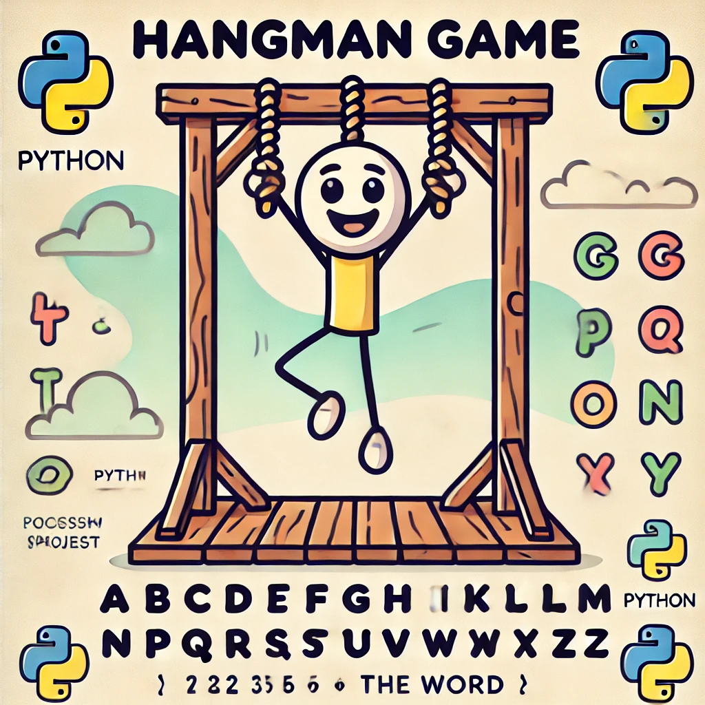

Here are the details of the project hangman game. There are Instructions and a skeleton code for your consideration.



## Instructions
Our code should be structured as follows:

1. Choose a word: The game randomly selects a word from a predefined list of words.
2. Display blanks: Display a series of dashes, representing each letter of the word to be guessed.
3. Guess a letter: Prompt the player to guess a letter. Validate the input (if it is not a single letter, or if it isn't a letter.)
4. Check the guess: Check if the guessed letter is in the word. If it is, reveal the letter in its correct position(s) in the blanks. If not, decrease the number of remaining attempts.
5. Repeat: Repeat steps 3-4 until the player either guesses the word correctly or runs out of attempts.
6. End game: If the player guesses the word correctly within the allowed attempts, congratulate them. Otherwise, reveal the word and inform them that they have lost.


You can use this skeleton code as a starting point, or just for better understanding the code logi (`pass` word here is only a placeholder).

<br>

**Skeleton Code**

```python

import random  # we are importing random module for choosing a word

# Define controling variables
# Here's the sample code for a list of words - substitute with your own list of words 
words = ['apple', 'banana', 'orange', 'grape', 'kiwi'] 
guessed_letters = []
correct_letters = []
word_letters = []
attempts = 6

def choose_word():
    '''
    This function randomly chooses a word from the list of words. It also takes makes a list of letters from the chosen word (it shouldn't contain the duplicates).
    The return values are the word and the list of letters.
    '''
    pass

def display_word(word, correct_guesses):
    '''
    This function takes in a word and a list of guessed letters, and returns a string that represents the word with the guessed letters revealed. It takes as input the word and a list of guessed letters.
    '''
    pass

def hangman():
    word, word_letters = choose_word()

    print('Welcome to Hangman!\n\n')

    display_word(word, guessed_letters)

    while attempts > 0:
        guess = input("Guess a letter: ").lower()

        # Check if the guess is a single letter - if not, print out to the user to use only single letters and go for the next guess
        # Chek if the guess is not a letter - if so, print out to the user that it is not a letter and go for the next guess

        # Check if the letter has been guessed already
        # - if so, print out to the user that they've already guessed that letter and go for the next guess
        # - if not, add the letter to the list of guessed letters
        
        # Check if the letter is in the word
        # - if so, print out to the user that they guessed correctly, add the letter to the list of correct guesses and display the updated word with the guessed letters revealed
        display_word(word, guessed_letters)


        # - if not, print out to the user that they guessed incorrectly and decrease the number of remaining attempts. If the attempts are 0, print out to the user that they've run out of attempts, reveal the word and end the game. If the attempts are not 0, go for the next guess.

        # if there are no remaining letters to guess, print out to the user that they've guessed the word correctly and end the game.
        pass

if __name__ == "__main__":
    hangman()
```