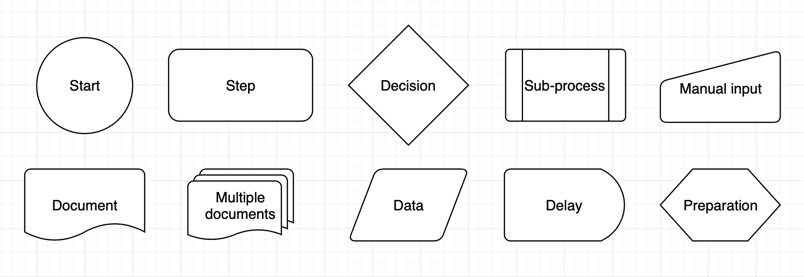
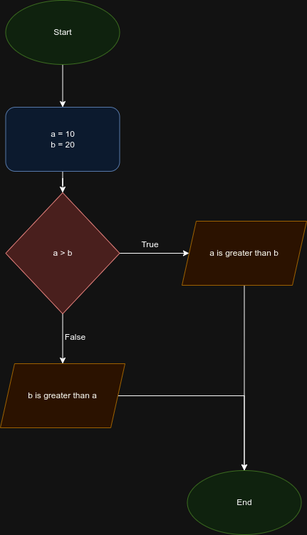

## 1. Flowchart Diagram

- Flowchart diagram is a visual representation of the flow of data in a program
- It is used to visualize the flow of data in a program
- Software Developers use flowchart to map the flow of data in a program and the way certain actions should be performed.
- Usually, flowchart can be modified over the course of the development of the program, when some more functionalities are added, updated, or removed.
<br>

- We will use [`drawio.io`](https://drawio-app.com/) to draw flowchart diagram

- Here are some instructions **Version 1**: [How to create flowcharts in draw.io](https://drawio-app.com/blog/flowcharts/)
**The different shapes used in flowcharts**



- **Start/End** – circles are sometimes used to indicate start and end points.
- **Steps** – a rectangle or square (often with rounded corners).
- **Decisions** – usually represented by a diamond.
- **A sub-process** – a normal step shape with borders on the left and right edges.
- **Manual input** – where a step requires someone to enter something manually, you can use this step ‘rectangle’ with a sloped ‘roof’.
- **Document or multiple documents** – where a step results in one or more documents, you can use these shapes
- **Data** – a parallelogram is used to indicate where information enters or leaves the process. For example, when an invoice is sent to a customer.
- **Delay** – this is used to show there is a delay before the next step.
- **Preparation** – used to indicate there are setup conditions required for the next step.

- Instruction - **Version 2**: [Draw a basic flow chart in draw.io
](https://www.drawio.com/doc/getting-started-basic-flow-chart)

Here are many different shapes used to visualise processes in a flow chart.


- **Rectangle** - Basic steps in your process.
- **Diamond (rhombus)** - Decisions, usually yes/no questions, that split the process into two or more branches.
- **Circle or oval** - Optional start and stop points in your process.
- **Parallelogram** - Input or output, where your process needs or gives information to an external party or system.
- **Cylinder** - Disk drives, used to indicate that data is stored during that step in the process.
- **Rectangle with a wavy bottom line** - Documents that are produced as a result of a process step.

### 1.1. Example Flowchart Diagram

- Let us see a simple Python code:


```python
a = 10
b = 20
if a > b:
    print("a is greater than b")
else:
    print("b is greater than a")
```

    b is greater than a


- We can see this flowchart in the image below:



[Link to the diagram](https://drive.google.com/file/d/1ddxGKsL0oe2jDy19ji2BnvzF_ZWIUEsf/view?usp=sharing)


- Here's an interesting link about using `Draw.io` and `VS Code`: [Flow charts and process diagrams with Draw.io & VS Code](https://paulvanderlaken.com/2020/12/22/draw-io-flow-chart-process-diagram-vscode/)
