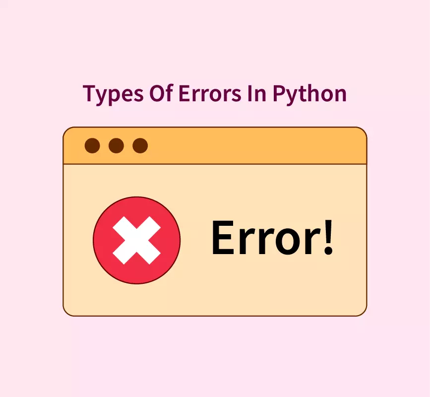

[Python Debugging Handbook](https://www.freecodecamp.org/news/python-debugging-handbook/)

Bugs and errors are the most common problems in programming. In this lesson we will learn how to debug and handle errors in Python.


## 5.3. Bugs

Bugs are errors in the code that make our code inoperable. Some of them are simple, some of them are hard to find and some of them are hard to fix. There are bugs that are immediately spotted by the interpreter, whilst other bugs are more difficult to find and fix because they are caused by the faulty logic of the program, or by some other external reason.

Let us see the most common types of bugs/errors in Python.

### 5.3.1. Common Error Messages

Python interpreter will indicate these errors to you in the form of an error message. These error messages are very helpful for debugging and fixing bugs.

#### 5.3.1.1. SyntaxError - invalid syntax 

Syntax errors are errors in the code that you write that are caused by a syntax mistake. For example, if you write a forbidden keyword as a variable name or if you forget to close a bracket, etc. Syntax errors can be easy to find and fix. The interpreter will indicate the line where the syntax error occurred.

# syntax error -
1name = 'John'


```python
# syntax error - missing colon
if 5 > 2
    print("Five is greater than two!")
```


      Cell In[4], line 2
        if 5 > 2
                ^
    SyntaxError: expected ':'


### 5.3.1.2. IndentationError - unexpected indent

- IndentationError is another type of error in Python. An indentation error happens when you forget to use the correct indentation.


```python
# indentation error
if 5 > 2:
print("Five is greater than two!")
```


      Cell In[5], line 3
        print("Five is greater than two!")
        ^
    IndentationError: expected an indented block after 'if' statement on line 2


```python
for i in range(10):
        if i == 5:
    break
```


      File <string>:3
        break
             ^
    IndentationError: unindent does not match any outer indentation level


 ### 5.3.1.3. NameError - name 'variable' is not defined

- A name error happens when you try to use a variable or function that has not been defined yet, or it has been deleted.


```python
# NameError: name 'x' is not defined
y = 20
print(x + y)

```


    ---------------------------------------------------------------------------

    NameError                                 Traceback (most recent call last)

    Cell In[12], line 3
          1 # NameError: name 'x' is not defined
          2 y = 20
    ----> 3 print(x + y)


    NameError: name 'x' is not defined


```python
# Name error - variable deleted

name = 'Tom'
print(name)
del name
print(name)

```

    Tom


    ---------------------------------------------------------------------------

    NameError                                 Traceback (most recent call last)

    Cell In[13], line 6
          4 print(name)
          5 del name
    ----> 6 print(name)


    NameError: name 'name' is not defined


### 5.3.1.4. AttributeError - 'object' has no attribute 'name'

- An AttributeError is a type of error that happens when you try to access an attribute or method that does not exist. For example, if you try to access the length of a string, you will get an error.


```python
# Attribute error example

my_tuple = (1, 2, 3)
my_tuple.append(4)  # AttributeError: 'tuple' object has no attribute 'append'

```


    ---------------------------------------------------------------------------

    AttributeError                            Traceback (most recent call last)

    Cell In[15], line 4
          1 # Attribute error example
          3 my_tuple = (1, 2, 3)
    ----> 4 my_tuple.append(4)  # AttributeError: 'tuple' object has no attribute 'append'


    AttributeError: 'tuple' object has no attribute 'append'


### 5.3.1.5. FileNotFoundError - [Errno 2] No such file or directory: 'file'

- A FileNotFoundError is a type of error that happens when you try to open a file that does not exist. For example, if you try to open a file that does not exist, you will get an error.


```python
# File not found error example

my_file = open('my_file.txt', 'r')
my_file.read()  # FileNotFoundError: [Errno 2] No such file or directory: 'my_file.txt'

my_file.close()
```


    ---------------------------------------------------------------------------

    FileNotFoundError                         Traceback (most recent call last)

    Cell In[17], line 3
          1 # File not found error example
    ----> 3 my_file = open('my_file.txt', 'r')
          4 my_file.read()  # FileNotFoundError: [Errno 2] No such file or directory: 'my_file.txt'
          6 my_file.close()


    File ~/anaconda3/envs/python312/lib/python3.12/site-packages/IPython/core/interactiveshell.py:324, in _modified_open(file, *args, **kwargs)
        317 if file in {0, 1, 2}:
        318     raise ValueError(
        319         f"IPython won't let you open fd={file} by default "
        320         "as it is likely to crash IPython. If you know what you are doing, "
        321         "you can use builtins' open."
        322     )
    --> 324 return io_open(file, *args, **kwargs)


    FileNotFoundError: [Errno 2] No such file or directory: 'my_file.txt'


### 5.3.1.6. IndexError - list index out of range

- An IndexError is a type of error that happens when you try to access an element in a list or tuple that is out of range.


```python
# IndexError

my_list = [1, 2, 3]
my_list[3]  # IndexError: list index out of range
```


    ---------------------------------------------------------------------------

    IndexError                                Traceback (most recent call last)

    Cell In[28], line 4
          1 # IndexError
          3 my_list = [1, 2, 3]
    ----> 4 my_list[3]  # IndexError: list index out of range


    IndexError: list index out of range


### 5.3.1.7. ImportError - No module named 'module'

- An ImportError is a type of error that happens when you try to import a module that does not exist. 


```python
# ImportError
import superman  # ModuleNotFoundError: No module named 'superman'

supeman.fly()  # AttributeError: 'module' object has no attribute 'fly'
```


    ---------------------------------------------------------------------------

    ModuleNotFoundError                       Traceback (most recent call last)

    Cell In[18], line 2
          1 # ImportError
    ----> 2 import superman  # ModuleNotFoundError: No module named 'superman'
          4 supeman.fly()  # AttributeError: 'module' object has no attribute 'fly'


    ModuleNotFoundError: No module named 'superman'


### 5.3.1.8. TypeError

- A TypeError is a type of error that happens when you try to perform an operation that is not possible. 
    - when you want to use + operator on a string and an integer
    - when you give a wrong number of arguments to a function
    - when you try to call an object as if it were a function, but it's not callable. 


```python
# TypeError string and number

x = 5
y = "Hello"
print(x + y)  # TypeError: unsupported operand type(s) for +: 'int' and 'str'
```


    ---------------------------------------------------------------------------

    TypeError                                 Traceback (most recent call last)

    Cell In[19], line 5
          3 x = 5
          4 y = "Hello"
    ----> 5 print(x + y)  # TypeError: unsupported operand type(s) for +: 'int' and 'str'


    TypeError: unsupported operand type(s) for +: 'int' and 'str'


```python
# TypeError - wrong number of arguments in a function
def add(a, b):
    return a + b


add(1, 2, 3)
```


    ---------------------------------------------------------------------------

    TypeError                                 Traceback (most recent call last)

    Cell In[20], line 6
          2 def add(a, b):
          3     return a + b
    ----> 6 add(1, 2, 3)


    TypeError: add() takes 2 positional arguments but 3 were given


```python
# TypeError: call non callable object

my_list = [1, 2, 3]
my_list()  # my_list is a list, not a function


```


    ---------------------------------------------------------------------------

    TypeError                                 Traceback (most recent call last)

    Cell In[23], line 4
          1 # TypeError: call non callable object
          3 my_list = [1, 2, 3]
    ----> 4 my_list()  # my_list is a list, not a function


    TypeError: 'list' object is not callable


### 5.3.1.9. ValueError

- A ValueError is a type of error that happens when you try to convert a value to a different type.
- it can occur when you give a wrong value to a function.
- it can also occur when you try to use mutable type as a key in a dictionary.


```python
# ValueError - convert non numeric string to int

my_string = "Hello"
int(my_string)  # ValueError: invalid literal for int() with base 10: 'Hello'
```


    ---------------------------------------------------------------------------

    ValueError                                Traceback (most recent call last)

    Cell In[24], line 4
          1 # ValueError - convert non numeric string to int
          3 my_string = "Hello"
    ----> 4 int(my_string)  # ValueError: invalid literal for int() with base 10: 'Hello'


    ValueError: invalid literal for int() with base 10: 'Hello'


```python
# call a function with a wrong type of argument
def divide(a, b):
    return a / b


divide('Hello', 'World')  # ValueError: unsupported operand type(s) for +: 'str' and 'str'
# TypeError: add_two_numbers() takes 2 positional arguments but 3 were given
```


    ---------------------------------------------------------------------------

    TypeError                                 Traceback (most recent call last)

    Cell In[27], line 6
          2 def divide(a, b):
          3     return a / b
    ----> 6 divide('Hello', 'World')  # ValueError: unsupported operand type(s) for +: 'str' and 'str'
          7 # TypeError: add_two_numbers() takes 2 positional arguments but 3 were given


    Cell In[27], line 3, in divide(a, b)
          2 def divide(a, b):
    ----> 3     return a / b


    TypeError: unsupported operand type(s) for /: 'str' and 'str'


## 5.4. Debugging and Error Handling

- [Python Documentation: *Errors and Exceptions*](https://docs.python.org/3/tutorial/errors.html)
- [Real Python: *Python Exceptions*](https://realpython.com/python-exceptions/)

- Debugging refers to the process of finding and fixing errors in your code.
- Debugging is the process of finding and fixing errors that make your code not work as intended.
- Debugging is a crucial part of software development.

### 5.4.1. SyntaxError

- Syntax Errors block the interpreter from executing your code. They need to be fixed before the code can be executed.

### 5.4.2. Exceptions (Errors)

- An exception is an error that occurs during the execution of a program. It interrupts the normal flow of the program and allows you to handle the error gracefully.
- When an exception occurs, Python will normally stop and generate an error message.

These exceptions can be handled using the `try` statement:
  - syntax:
  ```python
    try:
      # code that may raise an exception
    except:
      # code to handle the exception
    else:
      # code that will execute if there is no exception
    finally:
      # code that will always execute
  ```
  - `try` - tries to execute the code in the `try` block.
  - `except` - If an exception occurs, the code in the `except` block will be executed.
    - if no error type is specified, it will catch any exception - not a good practice
  - `else` - If no exception occurs, the code in the `else` block will be executed.
  - `finally` - If an exception occurs, the code in the `finally` block will be executed.


```python
# try except example

num = input("Enter a number: ")

try:
    result = 10 / num
except:  # catch all errors - we don't know what went wrong
    print("There's an error")
else:
    print("The result is", result)
```

    There's an error


```python
# try except example - with error specification

try:
    x = 5
    y = 0
    z = x / y
except ZeroDivisionError:  # ZeroDivisionError: division by zero error
    print("Error: Cannot divide by zero.")
else:
    print("The result is", z)
finally:
    print("End of program.")
```

    Error: Cannot divide by zero.
    End of program.


### 5.4.3. Multiple Exceptions

- Sometimes we have a situation in which our code can produce multiple errors in a single try block. There are different ways to handle multiple exceptions, but they are not evenly effective.

Let us see an example:


```python
num1 = input('Number 1: ')
num2 = input('Number 2: ')
try:
    num1 = int(num1)  # possible ValueError
    num2 = int(num2)  # possible ValueError
    print(num1/num2)  # possible ZeroDivisionError
except:
    print('Error: Invalid input.')
```

    Error: Invalid input.


Yes, but what input was invalid? Which error did we get?

We can try to catch the errors using the `except` block.


```python
num1 = input('Number 1: ')
num2 = input('Number 2: ')
try:
    num1 = int(num1)  # possible ValueError
    num2 = int(num2)  # possible ValueError
    print(num1/num2)  # possible ZeroDivisionError
except Exception as e:
    print(e)
```

    division by zero


This is a bit better, but we want to do something if the error occurs. We can use the `if else` block.


```python
import sys

num1 = input('Number 1: ')
num2 = input('Number 2: ')

try:
        num1 = int(num1)
        num2 = int(num2)
        print(num1/num2)
except Exception as e:
    if 'zero' in str(e):
        print('Division by 0')
        sys.exit()
    elif 'base 10' in str(e):
        print('Not a number')
        sys.exit()
```

That solves one problem, but introduces others. Try to understand why.

- Multiple errors can be handled by changing the order of the `except` blocks. Our first code could be be rewriten as follows:


```python
while True:
    num1 = input('Number 1: ')
    num2 = input('Number 2: ')
    try:
        num1 = int(num1)  # possible ValueError
        num2 = int(num2)  # possible ValueError
        print(num1/num2)  # possible ZeroDivisionError
    except ValueError:
        print('Error: Please, insert valid numbers.')
    except ZeroDivisionError:
        print('Error: Cannot divide by zero. Please, insert a valid number.')
    else:
        break
```

    Error: Cannot divide by zero. Please, insert a valid number.
    1.0


This is another story! 😄

### 5.4.4. Custom Errors
-[Real Python: *Python's Raise: Effectively Raise Errors in Your Code*](https://realpython.com/python-raise-exception/)

- We can define our own errors using the `raise` statement.


```python
# invalid input value

name = 'John Wayne'

if name == 'John Wayne':
    raise ValueError('Please, enter a valid name.')
```


    ---------------------------------------------------------------------------

    ValueError                                Traceback (most recent call last)

    Cell In[1], line 6
          3 name = 'John Wayne'
          5 if name == 'John Wayne':
    ----> 6     raise ValueError('Please, enter a valid name.')


    ValueError: Please, enter a valid name.


### Choosing the Right Exception Type

Python has many built-in exceptions. You can raise different types of exceptions depending on the error condition. Here are some commonly used ones:

- `TypeError`: Raised when an operation or function is applied to an object of inappropriate type.
- `ValueError`: Raised when a function receives an argument of the correct type but an inappropriate value.
- `IndexError`: Raised when you try to access an index that is out of range.

### Examples of Raising Specific Exceptions

#### Example 1: TypeError

Raise a `TypeError` if the input is not an integer:

```python
x = "hello"

if not isinstance(x, int):
    raise TypeError("Only integers are allowed")
```

Here, the `isinstance` function checks if `x` is an integer. If it's not, a `TypeError` is raised with the message "Only integers are allowed".

#### Example 2: ValueError

Raise a `ValueError` if the input is not within an expected range:

```python
age = -5

if age < 0 or age > 120:
    raise ValueError("Age must be between 0 and 120")
```

This code checks if `age` is within the range of 0 to 120. If it's not, a `ValueError` is raised with the message "Age must be between 0 and 120".

#### Example 3: IndexError

Raise an `IndexError` if trying to access an index that is out of range:

```python
my_list = [1, 2, 3]
index = 5

if index >= len(my_list):
    raise IndexError("Index out of range")
```

This example checks if `index` is within the bounds of `my_list`. If `index` is out of range, an `IndexError` is raised with the message "Index out of range".

### Custom Exceptions

You can also define your own exceptions by creating a new class that inherits from the `Exception` class:

```python
class CustomError(Exception):
    pass

def check_condition(x):
    if x < 0:
        raise CustomError("Custom error: x cannot be negative")

check_condition(-1)
```

In this example, `CustomError` is a user-defined exception. The function `check_condition` raises this exception if `x` is less than 0.

### Summary

Raising exceptions in Python allows you to handle error conditions gracefully. You can use built-in exception types or define your own to provide meaningful error messages and keep your code robust. Here are some key points:

- Use the `raise` keyword to raise an exception.
- Choose the appropriate exception type based on the error condition.
- Provide a clear error message to help understand the issue.
- Consider defining custom exceptions for specific use cases.

By understanding and using exceptions effectively, you can make your Python programs more reliable and easier to debug.
