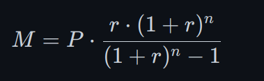

## Project Summary

### Customer Request

In the US, you can purchase a car with a loan. The car loan will carry an interest rate, taxes, and fees. Gas prices also influence how much you will pay just to drive each month. I would like you to build me a calculator which runs in the terminal and asks the user for information relevant to their upcoming car purchase. The user should be able to input two vehicles and as much information you think is relevant to the car buying experience.

### Minimum Requirements

- Calculate monthly gas costs based on the MPG/gas efficiency of the car and how much the user drives weekdays and weekend.
- You must consider how much the user expects each car to cost in repairs and maintenance for 1 year.
- The cost of the car loan and interest rate for buying that car. You must take in these two parameters and write a function to calculate the person's monthly cost.
- If they want to introduce a down payment or not and that should affect the principal amount of the loan (If down payment, the principal is lower).
- The final output of the application/program should be a concise printout of all the information the user submitted as well as a recommendation as to why they should buy one over the other and reasons why clearly outlined.

### Components Breakdown

#### Component 1: User Input

- Ask the user to input the following information:
  - Vehicle details: make, model, year, mileage, and fuel efficiency (MPG) (some of these you could get from an API or web scraper)
  - Driving habits: weekday mileage, weekend mileage, and total miles driven per year
  - Expected annual repairs and maintenance costs for each vehicle (this could also be taken from an API or web scraper)
  - Expected purchase price for each vehicle
  - Loan interest rate
  - Option to include a down payment (yes/no)
  - If yes, specify the amount of the down payment
- Ensure that the user input is valid and handles any errors that may occur during data entry.

#### Component 2: Loan Calculation

- Calculate the monthly loan payment using the formula:

- In Python, that would be: `M = P * (r * (1 + r)^n) / ((1 + r)^n - 1)`
  - Where:
    - M = monthly loan payment
    - P = principal amount of the loan (purchase price minus down payment)
    - r = monthly interest rate (annual interest rate divided by 12)
    - n = number of payments (number of months in the loan term)
- If a down payment is included, subtract the down payment from the purchase price to calculate the principal amount.
- Consider using a library such as `numpy` or `scipy` to simplify the calculation.

#### Component 3: Gas Cost Calculation

- Calculate the monthly gas cost using the formula:
  - G = (total miles driven per year/fuel efficiency)* (gas price per gallon) / 12
  - Where:
    - G = monthly gas cost
    - fuel efficiency = MPG
    - total miles driven per year = sum of weekday and weekend mileage
    - gas price per gallon
- Consider using a library such as `math` to simplify the calculation.
- Also, consider using an `API` or `web scraping` to get the MPG and monthly gas cost for each vehicle.

#### Component 4: Repair and Maintenance Cost Calculation

- Calculate the annual repair and maintenance cost for each vehicle using the user input.
- Calculate the monthly repair and maintenance cost by dividing the annual cost by 12.
- Consider using an `API` or `web scraping` to get the repair and maintenance cost for each vehicle.

#### Component 5: Recommendation

- Based on the calculated costs, provide a recommendation to the user on which vehicle to buy, considering factors such as:
  - Monthly loan payment
  - Gas cost
  - Repair and maintenance cost
  - Overall cost of ownership
- Clearly outline the reasons for the recommendation in your output.

#### Component 6: Output

- Print out all the user input data to the terminal.
- Provide a concise summary of the calculated costs for each vehicle.
- Include a recommendation based on your analysis.
- Follow PEP-8 standards for code formatting and style.

**Suggestions for Using APIs or Web Scraping:**

1. **Rapid API:** Use the Rapid API to fetch data from external sources like gas prices, repair and maintenance costs, etc.
2. **Websites for Scraping:** If you use web scraping, these are some websites you can consider:
   - [Caredge.com](https://caredge.com/ranks/maintenance) - For car maintenance costs
   - [Gasprices.aa.com](https://gasprices.aaa.com/state-gas-price-averages/) - For gas prices
   - [Fleetnews.co.uk](https://www.fleetnews.co.uk/news/real-world-tests-reveal-cars-with-best-and-worse-mpg-fuel-economy) - For mileage per gallon (MPG) efficiency

**Additional Tips:**

1. **Use Commenting:** Use comments to explain your code and make it easier for others to understand.
2. **Test Your Code:** Test your code thoroughly to ensure that it works correctly and handles errors properly.
3. **Follow PEP8 Guidelines:** Follow PEP8 guidelines for coding style and formatting.
4. **Use Version Control (optional):** Use version control tools such as Git to track changes to your code and collaborate with others.
5. **External Files For Screen Outputs:** Use external files for screen outputs such as instructions to the user, menu screen, etc. Avoid using multiple line strings when possible.
6. **Implement Key Press detection and screen cleaning:** Use key press detection and screen cleaning to make the program more responsive and user-friendly. There are differences between Windows and Unix systems, so you would have to detect which system is being used in order to have these options working.
7. **Make necessary setup files**: Make necessary setup files for your projects:
   - `.gitignore`
   - `requirements.txt`
   - `README.md`
   - `.env`
8. **Use Documentation:** Write documentation for your code and explain how it works, which technologies you are using, and features of your code.
9. **GitHub Upload:** Upload your project to GitHub.
10. **YouTube Video:** Record and upload a YouTube video of your project where you explain your code and the execution of it.

### Additional Tips

- Consider using a class or object-oriented programming to organize your code and make it more maintainable.
- Use meaningful variable names and comments to make your code easy to understand.
- Test your code thoroughly to ensure it works correctly for various inputs.
- If using an `API` or `web scraping` to get the repair and maintenance cost for each vehicle, make sure to use the same currency as the user's currency preference. And, in order to economize on API calls, save the output from the API to a file and give an option to read from the file if there is one, or update the file if you think the file would be outdated.

### Additional Resources

There's a video of one of the students going throught this project:
[Project 1. Car Calculator App](https://youtu.be/_29ptYt06_I)

**Conclusion:**

The project should be your showcase of Python knowledge and skills. It should be a fun and educational learning experience. And I will assist all of you to make it presentable and according to the industry standards.
