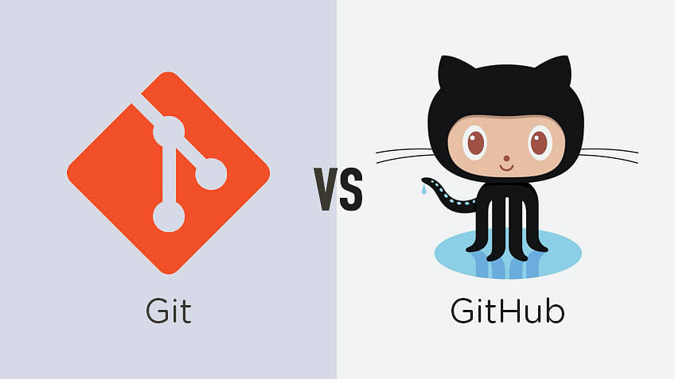

## Version Control with Git and GitHub

Version control is a necessary tool for keeping track of changes and keeping track of changes in your files. It is a crucial part of any project.

It gives you a record of changes and allows you to revert to a previous version of your files. It also allows you to share your files with other people, and enables you to collaborate with others. It is tracking who made changes and when.

Here we will be using Git and GitHub.

## Resources

To add text in red, you can use HTML tags within the Markdown cell. Here's an example of how you can modify the content:

## Version Control with Git and GitHub

Version control is a necessary tool for keeping track of changes and keeping track of changes in your files. It is a crucial part of any project.

It gives you a record of changes and allows you to revert to a previous version of your files. It also allows you to share your files with other people, and enables you to collaborate with others. It is tracking who made changes and when.

Here we will be using Git and GitHub.

## Resources

There are different resources related to the version control in the resources article on this page.

### Git and GitHub Tutorials

- [Mosh: *Git Tutorial for Beginners: Learn Git in 1 Hour*](https://youtu.be/8JJ101D3knE)
- [Anton Zhiyanov: *Git by example: Interactive guide*](https://antonz.org/git-by-example/?ref=dailydev)
- [Ihechikara Vincent Abba: Git and GitHub Tutorial – Version Control for Beginners](https://www.freecodecamp.org/news/git-and-github-for-beginners/)
- [Paul Ehikhuemen: *Git and GitHub Basics: A Beginner's Guide*](https://pauloe-me.medium.com/git-and-github-basics-a-beginners-guide-6d57c1f0e663)
- [Gurpreet Singh: *Git Tutorial for Beginners: A Comprehensive Guide to Mastering Version Control*](https://medium.com/@igurpreetsingh/git-tutorial-for-beginners-a-comprehensive-guide-to-mastering-version-control-a0da3eb0b6e8)
- [FreeCodeCamp: *Learn Git in Detail to Manage Your Code*](https://www.freecodecamp.org/news/learn-git-in-detail-to-manage-your-code/)

### Useful Links for Practical Use

- [GitHub Docs: *GitHub SSH Keys*](https://docs.github.com/en/authentication/connecting-to-github-with-ssh/generating-a-new-ssh-key-and-adding-it-to-the-ssh-agent?platform=linux)
- [Cbeams: *How to Write a Git Commit Message*](https://cbea.ms/git-commit/)
- [Victoria Dye: *Write Better Commits, Build Better Projects*](https://github.blog/2022-06-30-write-better-commits-build-better-projects/)
- [European Commission: *Git Commit Guidelines*](https://ec.europa.eu/component-library/v1.15.0/eu/docs/conventions/git/)

### Git Documentation
Git has an amazing documentation. Here are some of the links:

- [Git Documentation](https://git-scm.com/docs)
- [Git Videos](https://git-scm.com/videos)
- [Scot Chacon: *Pro Git*](https://git-scm.com/book/en/v2/) - This free book is a great resource for digging more deeply into Git.
- [Git Cheetsheet](https://training.github.com/downloads/github-git-cheat-sheet.pdf)
- [Other Git resources](https://git-scm.com/doc/ext)

## Introduction to Git

Git is a distributed version control system (VCS) designed to handle everything from small to very large projects with speed and efficiency. Created by Linus Torvalds in 2005 for the development of the Linux kernel, Git has since become the most widely used version control system in the world. It allows multiple developers to work on the same project simultaneously without interfering with each other's changes, making it an essential tool for modern software development.

### Key Points on Why Git is Useful

1. **Version Control**: Git tracks changes in source code during software development, enabling developers to revert to previous versions if needed.
2. **Collaboration**: Multiple developers can work on the same project simultaneously, with Git managing changes and merges.
3. **Branching and Merging**: Git supports lightweight branching and merging, allowing developers to experiment with new features or fix bugs in isolated branches before merging them into the main codebase.
4. **Distributed Development**: Every Git clone is a full-fledged repository with complete history and full version-tracking capabilities, not dependent on network access or a central server.
5. **Performance**: Git is fast and efficient, handling large repositories with ease, making it suitable for projects of any size.
6. **Flexibility**: Git can handle a wide variety of workflows, supporting everything from solo projects to large teams and complex branching models.

### Basic Git Commands

- **`git init`**: Initializes a new Git repository in the current directory.
- **`git clone <repository>`**: Creates a local copy of a remote repository.
- **`git status`**: Displays the state of the working directory and the staging area, showing which changes have been staged, which haven't, and which files aren't being tracked by Git.
- **`git add <file>`**: Adds changes in the specified file(s) to the staging area, preparing them for the next commit.
- **`git commit -m "message"`**: Records the changes made to the files in the local repository, with a descriptive message.
- **`git push`**: Uploads local repository content to a remote repository.
- **`git pull`**: Fetches and merges changes from a remote repository to the local repository.
- **`git branch`**: Lists all branches in the local repository.
- **`git checkout <branch>`**: Switches to the specified branch.
- **`git merge <branch>`**: Merges the specified branch into the current branch.
- **`git log`**: Shows the commit history for the repository.

These commands form the foundation of Git operations, enabling developers to manage and track their code effectively.

## Introduction to GitHub

GitHub is a web-based platform that provides hosting for software development and version control using Git. It offers a range of collaborative features and tools to facilitate the efficient management of software projects. Launched in 2008, GitHub has become one of the most popular code hosting platforms, widely used by individual developers and large organizations alike. In addition to hosting repositories, GitHub provides a suite of features that include issue tracking, project management, and continuous integration/deployment (CI/CD).

### Key Points on Why GitHub is Useful

1. **Collaboration**: GitHub enables multiple developers to work on the same project by providing tools for code review, discussion, and project management. Pull requests, code reviews, and team discussions enhance collaborative workflows.
2. **Version Control**: Integrates seamlessly with Git, allowing for efficient version control, branching, and merging of code. GitHub tracks changes and manages different versions of codebases effectively.
3. **Project Management**: Offers built-in project management tools such as issues, milestones, and project boards, making it easier to plan, track, and discuss work within the same platform.
4. **Community and Open Source**: Hosts a vast number of open-source projects, making it easy for developers to contribute to or fork existing repositories. GitHub's social features foster a strong community around software projects.
5. **CI/CD Integration**: Supports continuous integration and continuous deployment through GitHub Actions and integrations with other CI/CD tools. This allows for automated testing and deployment of code changes.
6. **Documentation**: Provides tools for creating and maintaining documentation directly within repositories, such as README files, Wikis, and GitHub Pages for hosting project documentation websites.
7. **Security Features**: Includes features like dependency graphs, vulnerability alerts, and secret scanning to enhance the security of software projects.

## Alternatives to GitHub

1. **GitLab**: A web-based DevOps lifecycle tool that provides a Git repository manager providing wiki, issue-tracking, and CI/CD pipeline features, using an open-source license. GitLab is highly customizable and supports both on-premises and cloud-hosted options.
2. **Bitbucket**: A Git repository management solution designed for professional teams. It integrates well with Atlassian products like Jira and Confluence and supports both Git and Mercurial repositories.
3. **SourceForge**: One of the original platforms for hosting open-source projects, offering tools for version control, bug tracking, and project management. SourceForge supports Git, SVN, and Mercurial repositories.
4. **Azure DevOps**: Microsoft's suite of development tools that includes version control, build and release management, and project tracking. It integrates tightly with Azure cloud services and supports Git repositories.
5. **AWS CodeCommit**: A fully managed source control service hosted by Amazon Web Services that makes it easy for teams to host secure and scalable Git repositories.
6. **Gitea**: A lightweight, self-hosted Git service that is easy to install and maintain. Gitea is an open-source project that aims to provide a simple, fast, and painless way of setting up a self-hosted Git service.

These alternatives offer various features and benefits, catering to different needs and preferences. Whether for small teams, large enterprises, or individual developers, there is a range of options to support version control and collaboration workflows.
