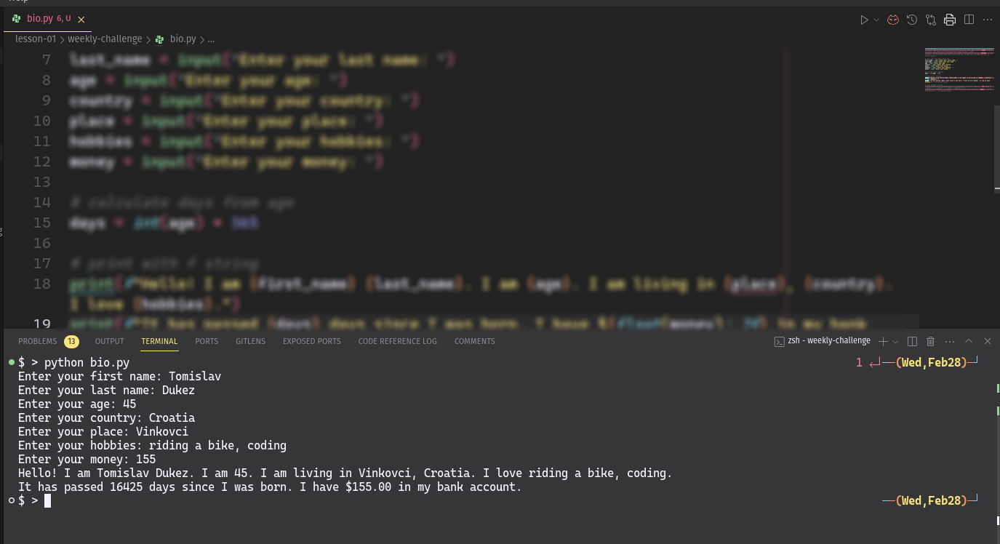

## Challenge 1: Install Python on your local machine

- Install Python on your local machine. You can do it by installing:
  a. Python from [here](https://www.python.org/downloads/).
  b. [Anaconda](https://www.anaconda.com/products/distribution).

## Challenge 2: Install an IDE on your local machine

- Install an IDE on your local machine. You can choose:
  a. Visual Studio Code from [here](https://code.visualstudio.com/).
  b. PyCharm Community Edition from [here](https://www.jetbrains.com/pycharm/download/).
  c. Sublime Text from [here](https://www.sublimetext.com/).

## Challenge 3: Install Git on your local machine

- You can install Git from [here](https://git-scm.com/downloads).
- Here are the instructions to install Git for different operating systems:
  [How to install Git](https://www.atlassian.com/git/tutorials/install-git)

## Challenge 4: 'Hello World' in Python

- Write a simple Python program to print `Hello, World!`. Save it in a file with the name `hello.py`.
- Run the program using the command line.
- Make a screenshot of the code and the output and save it as `hello` image file.


## Challenge 5: 'Short bio' in Python

- Write a Python program to print your short bio. Save it in a file with the name `bio.py`.
- Your code should ask user for:
    a. First Name
    b. Last Name
    c. Age
    d. Country
    e. Place
    f. Hobbies
    g. Money
- Run the program using the command line.
- The output should be:
  ```
  Hello! I am `First Name` `Last Name`. I am `Age`. I am living in `Place`, `Country`. I love `Hobbies`.
  It has passed `x` days since I was born. I have $`Money` in my bank account.
  ```
    where `x` is the number of days since the user was born. You will need to calculate the number of days since the user was born.
    `Money` should be a floating point number with 2 decimal places.
- Make a screenshot of the code and the output and save it as `bio` image file.



Once you have completed the tasks, submit the following files by attaching them to an email with subject `Challenge 1`:
- `hello.py`
- `hello.png` (screenshot of the code and the output - can be in jpg, jpeg, or png format)
- `bio.py`
- `bio.png` (screenshot of the code and the output - can be in jpg, jpeg, or png format)
